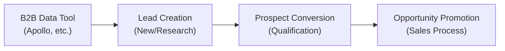

# HaloPSA CRM Custom Integration - B2B Data Sourcing Tools


## 📊 Development Status

| Aspect | Status | Details |
|--------|--------|---------|
| **Maturity** | Beta | Core integrations tested, expanding provider coverage |
| **Documentation** | Comprehensive | Complete API guides, examples, and configuration schemas |
| **Testing** | Defining | Testing framework and coverage being established |
| **CI/CD** | Basic | Documentation deployment pipeline active, branch protection enforced |
| **Community** | Solo | Individual maintainer, open to contributions |


## Overview

Production-ready integration architecture for connecting HaloPSA with B2B data sourcing tools using a **custom Lead → Prospect → Opportunity workflow**. Designed for developers, technical architects, and MSPs building maintainable integrations with automated entity progression.

**[Complete Documentation →](https://sjackson0109.github.io/halopsa-crm-b2b-integration/)**


## Custom CRM Workflow

This integration implements a sophisticated three-stage customer acquisition lifecycle:


### Lead Lifecycle (Research → Introductions → Conversion)

- Alternative exits: No Interest, Do Not Contact, Invalid Data


### Prospect Lifecycle (Prospecting → Qualification)

- Alternative exit: Disqualified


### Opportunity Lifecycle (Progressing → Negotiation)


**[Complete Workflow Documentation →](docs/custom-crm-configuration.md)**


### Entity Attributes & Custom Fields

**Lead Entity:** Contact data + Research intelligence (Services Offered, Growth Signals, Project Pipelines)  
**Prospect Entity:** Inherited Lead data + Qualification data (Pain Points, Budget Range, Decision Maker, Fit Score)  
**Opportunity Entity:** Inherited data + Sales data (Opportunity Value, Probability %, Expected Close Date, Competitors)


### Supported B2B Data Providers
- **Apollo.io** - Lead database and engagement platform
- **ZoomInfo** - B2B contact and company database (benchmark)
- **UpLead** - B2B contact discovery platform
- **Hunter** - Email finder and verification
- **Lusha** - Contact and company database
- **Seamless.ai** - Real-time search engine for B2B contacts
- **Lead411** - B2B sales intelligence platform
- **RocketReach** - Contact information database
- **BookYourData/LeadsBlue** - B2B lead generation service
- **Crayon** - European B2B data platform with intent signals
- **Klue** - Conversational intelligence for B2B sales
- **MadKudu** - B2B lead scoring and qualification
- **LeadIQ** - Sales intelligence with LinkedIn integration
- **HG Data** - European B2B contact database with GDPR compliance
- **DiscoverOrg** - B2B intent data and technographics
- **Bombora** - B2B intent data from online behaviour
- **EverString** - Predictive B2B lead scoring using AI
- **Datanyze** - B2B sales intelligence and technographics


## Integration Architecture


### Core Integration Methods
1. **Direct REST API Integration** - API-to-API data synchronisation
2. **Webhook-based Ingestion** - Real-time data push from B2B tools
3. **Halo Integrator Service** - Native polling service for custom endpoints
4. **Middleware Orchestration** - Custom transformation and routing logic
5. **iPaaS Solutions** - Third-party integration platforms


### HaloPSA Integration Capabilities
- **REST API** (OAuth / Client ID + Secret)
- **Webhooks** (Inbound and Outbound)
- **Halo Integrator** (Native polling service for custom API endpoints)
- **Runbooks** (Automation workflows)
- **Third-party iPaaS** (n8n, Make, Integrately, Zapier, Power Automate)


### Data Flow Pattern



## 🚀 Production Implementation


### 1. Custom Workflow Integrator
Ready-to-deploy service with automated entity progression:

```javascript
// examples/custom-middleware/custom-crm-workflow-integrator.js
const integrator = new CustomCRMWorkflowIntegrator(config);

// Automated workflow processing
const result = await integrator.poll();
// ✓ Apollo data → Lead creation
// ✓ Lead status "engaged" → Prospect conversion  
// ✓ Prospect "qualified" + fit score ≥70 → Opportunity promotion
// ✓ Call record synchronisation

console.log(result.metrics);
// {
//   leads_created: 12,
//   prospects_converted: 3,
//   opportunities_promoted: 1
// }
```


### 2. JSON Configuration Library
Complete API configurations for immediate deployment:

```bash
schemas/
├── apollo-io-config.json          # Apollo search, field mappings, workflow
├── zoominfo-config.json           # ZoomInfo contact discovery
├── hunter-io-config.json          # Email verification & discovery  
├── halopsa-api-config.json        # Custom Lead/Prospect/Opportunity schemas
├── halo-integrator-config.json    # Native HaloPSA polling service
├── webhook-payloads.json          # Inbound webhook validation
└── environment-config.json        # API keys & tenant configuration
```


### 3. Integration Methods
- **Custom Middleware** - Complete workflow automation service
- **Halo Integrator** - Native HaloPSA polling service  
- **Webhooks** - Real-time data ingestion
- **n8n Workflows** - Visual automation platform
- **Direct API** - REST API integrations


## Repository Structure

```
├── docs/
│   ├── data-models/          # HaloPSA and B2B tool data schemas
│   ├── authentication/       # OAuth flows and API authentication
│   ├── webhooks/             # Webhook payload specifications
│   ├── middleware/           # Integration architecture patterns
│   └── error-handling/       # Error handling and deduplication
├── schemas/ 📋
│   ├── apollo-io-config.json      # Apollo.io API configuration & queries
│   ├── zoominfo-config.json       # ZoomInfo API setup & field mappings  
│   ├── hunter-io-config.json      # Hunter.io configuration & templates
│   ├── halopsa-api-config.json    # HaloPSA entity schemas & endpoints
│   ├── halo-integrator-config.json # Halo Integrator service setup
│   ├── webhook-payloads.json      # Webhook payload schemas
│   └── environment-config.json    # Environment variables template
├── examples/ 🚀
│   ├── custom-middleware/
│   │   └── apollo-halo-integrator.js  # Production-ready Node.js service
│   ├── custom-fuctions/
│   │   ├── phone-number-normaliser.js # Phone number E.164/E.123 formatter
│   │   ├── e164_e123_country_code_table.xml # Country code data
│   │   └── README.md                  # Phone normalization guide
│   ├── n8n-workflows/
│   │   └── apollo-to-halopsa-sync.json # Complete n8n workflow
│   └── .env.example               # Environment configuration template
```


## Key Features Covered


### Data Models & Field Mappings
- HaloPSA entity schemas (Prospects, Organisations, Contacts)
- B2B tool data structure mapping
- Field transformation patterns
- Data validation rules
- **Phone Number Normalization**: E.164/E.123 formatting utility


### Authentication Flows
- OAuth 2.0 implementations
- API key management
- Token refresh mechanisms
- Security best practices


### Webhook Integration
- Payload specifications
- Event handling patterns
- Retry mechanisms
- Security validation


### Error Handling & Deduplication
- Duplicate detection algorithms
- Error recovery patterns
- Rate limiting strategies
- Monitoring and alerting


### Middleware Recommendations
- **HaloPSA Native**: Halo Integrator, Custom Integrations, Webhooks, Runbooks
- **Third-party iPaaS**: n8n, Make, Zapier, Power Automate
- **Custom Services**: Node.js, Python, .NET implementations


## Target Audience

- **Developers**: Building custom integrations and middleware
- **Technical Architects**: Designing scalable integration solutions
- **MSPs**: Implementing client data management workflows
- **Integration Specialists**: Creating maintainable automation solutions


## Quick Start


### 1. Choose Your Integration Method
- **Halo Integrator** (Recommended): Use [halo-integrator-config.json](schemas/halo-integrator-config.json) for native polling setup
- **Custom API**: Implement using [apollo-halo-integrator.js](examples/custom-middleware/apollo-halo-integrator.js) example
- **n8n Workflow**: Import [apollo-to-halopsa-sync.json](examples/n8n-workflows/apollo-to-halopsa-sync.json) 


### 2. Configure Your Environment  
Copy [.env.example](examples/.env.example) and configure:
```bash
cp examples/.env.example .env
# Edit .env with your API keys and settings
```


### 3. Set Up B2B Data Source
Use the JSON configs for API setup:
- [Apollo.io](schemas/apollo-io-config.json) - Search queries and field mappings
- [ZoomInfo](schemas/zoominfo-config.json) - Authentication and data models
- [Hunter.io](schemas/hunter-io-config.json) - Email discovery and verification


### 4. Configure HaloPSA
Reference [halopsa-api-config.json](schemas/halopsa-api-config.json) for:
- Entity schemas and required fields
- API endpoints and authentication
- Custom field setup


#### Required Custom Fields Setup
The integration requires the following custom fields to be configured in HaloPSA:

**Lead Entity Custom Fields (18 fields):**

| FieldName | Field Label | Type | Default Value | Field Hint | Field Group |
|-----------|-------------|------|---------------|------------|-------------|
| CFLeadSource | Lead Source | Dropdown | Apollo.io | Source platform identification | Lead Basics |
| CFLeadServicesOffered | Services Offered | Text |  | Primary business offerings | Lead Basics |
| CFLeadGrowthSignals | Growth Signals | Text |  | Expansion/growth indicators | Lead Basics |
| CFLeadProjectPipelines | Project Pipelines | Text |  | Pipeline opportunities | Lead Basics |
| CFDND | Do Not Contact | Boolean | false | Contact restriction flag | Lead Basics |
| CFLeadTechStack | Technology Stack | Text |  | Current technologies and software in use | Lead Basics |
| CFLeadRevenueRange | Revenue Range | Dropdown | $1-5M | Annual revenue bracket (<$1M, $1-5M, $5-10M, $10-25M, $25-50M, $50-100M, $100M+) | Company Profile |
| CFLeadEmployeeCount | Employee Count Range | Dropdown | 51-200 | Company size category (1-10, 11-50, 51-200, 201-500, 501-1000, 1001-5000, 5000+) | Company Profile |
| CFLeadFoundingYear | Company Founded Year | Integer |  | Year company was established | Company Profile |
| CFLeadHQLocation | Location/HQ Address | Text |  | Company headquarters location | Company Profile |
| CFLeadManagementLevel | Management Level | Dropdown | Manager | Contact's seniority (CEO, CFO, CTO, COO, President, Vice President, Director, Senior Manager, Manager, Senior, Individual Contributor, Other) | Contact Profile |
| CFLeadDepartmentFunction | Department Function | Dropdown | IT | Contact's department (IT, Finance, Operations, Sales, Marketing, HR, Legal, Engineering, Product, Customer Success, Procurement, Supply Chain, Manufacturing, R&D, Compliance, Business Development, Communications, Facilities, Security, Other) | Contact Profile |
| CFLeadIntentSignals | Intent Signals | Memo |  | Structured intent data: website visits, content downloads, search terms, job postings, competitor mentions, social engagement, email interactions | Intent & Behavior |
| CFLeadIntentStrength | Intent Strength | Dropdown | Low | Buying intent level (Low, Medium, High, Urgent) | Intent & Behavior |
| CFLeadIntentStage | Intent Stage | Dropdown | Awareness | Buyer's journey stage (Awareness, Consideration, Decision, Purchase) | Intent & Behavior |
| CFLeadIntentSource | Intent Source | Dropdown | Organic | How intent was detected (Organic Search, Paid Ads, Social Media, Referrals, Direct, Content Marketing, Events) | Intent & Behavior |
| CFLeadLastIntentActivity | Last Intent Activity | Date |  | Date of most recent intent signal | Intent & Behavior |
| CFLeadIntentTopics | Intent Topics | Text |  | Specific topics/products showing interest (e.g., "cloud migration, cybersecurity, data analytics") | Intent & Behavior |

**Prospect Entity Custom Fields (20 fields) - Organised by Field Groups (sections):**


### Qualification Section (8 fields)
| FieldName | Field Label | Type | Default Value | Field Hint | Field Group |
|-----------|-------------|------|---------------|------------|-------------|
| CFProspectPainPoints | Pain Points | Text |  | Confirmed business challenges | Qualification |
| CFProspectServices | Qualified Services | Text |  | Matching service offerings | Qualification |
| CFProspectDecisionMakers | Decision Maker | String |  | Key stakeholder information | Qualification |
| CFProspectFitScore | Fit Score | Integer |  | Overall qualification score (0-100) | Qualification |
| CFProspectBudget | Budget Range | Dropdown | <$10K | Available budget estimation (<$10K, $10K-$50K, $50K-$100K, $100K-$500K, $500K+) | Qualification |
| CFProspectTimeframe | Timeframe | Dropdown | 3-6 months | Expected implementation timeline (Immediate, 1-3 months, 3-6 months, 6-12 months, 12+ months) | Qualification |
| CFProspectIndustry | Industry/Sector | Dropdown | Technology | Primary industry classification (Technology, Healthcare, Finance, Manufacturing, Retail, Education, Government, Professional Services, Construction, Real Estate, Transportation, Energy, Utilities, Telecommunications, Media & Entertainment, Agriculture, Food & Beverage, Hospitality, Automotive, Aerospace, Defence, Pharmaceuticals, Biotechnology, Chemicals, Mining, Insurance, Legal Services, Non-Profit, Other) | Qualification |
| CFProspectRegion | Geographic Region | Dropdown | UK | Geographic territory (North America, USA, Canada, Mexico, Central America, Caribbean, South America, Brazil, Argentina, Chile, Colombia, Peru, Venezuela, Europe, UK, Germany, France, Italy, Spain, Netherlands, Belgium, Switzerland, Austria, Nordic Countries, Eastern Europe, Russia, Asia Pacific, China, Japan, South Korea, India, Australia, New Zealand, Southeast Asia, Indonesia, Thailand, Philippines, Vietnam, Singapore, Middle East, UAE, Saudi Arabia, Qatar, Kuwait, Oman, Bahrain, Israel, Turkey, Iran, Iraq, Africa, South Africa, Nigeria, Kenya, Egypt, Morocco, Ghana, Ethiopia, Tanzania, Sub-Saharan Africa, North Africa, East Africa, West Africa, Central Africa, Southern Africa) | Qualification |


### Prospect Management Section (6 fields)
| FieldName | Field Label | Type | Default Value | Field Hint | Field Group |
|-----------|-------------|------|---------------|------------|-------------|
| CFProspectCompetition | Competition | Text |  | Who else they're talking to | Prospect Management |
| CFProspectCompetitionStrength | Competition Strength | Dropdown | Moderate | Competitive landscape assessment (Weak, Moderate, Strong, Dominant) | Prospect Management |
| CFProspectDealValue | Estimated Deal Value | Text |  | Estimated deal size/value | Prospect Management |
| CFProspectExpectedClose | Expected Close Date | Date |  | Anticipated deal closure date | Prospect Management |
| CFProspectNextAction | Next Action Item | Text |  | Specific action required to advance the deal | Prospect Management |
| CFProspectPriority | Sales Priority | Dropdown | Medium | Priority level for follow-up activities (Low, Medium, High, Critical) | Prospect Management |


### Stakeholders & Communication Section (6 fields)
| FieldName | Field Label | Type | Default Value | Field Hint | Field Group |
|-----------|-------------|------|---------------|------------|-------------|
| CFProspectAdditionalStakeholders | Additional Stakeholders | Text |  | Other key people involved in decision | Stakeholders & Communication |
| CFProspectInternalChampion | Internal Champion | String |  | Prospect's internal advocate | Stakeholders & Communication |
| CFProspectCommunicationHistory | Communication History | Memo |  | Summary of all interactions and touchpoints | Stakeholders & Communication |
| CFProspectObjections | Objections/Concerns | Memo |  | Key concerns and objections to address | Stakeholders & Communication |
| CFProspectBuyingProcess | Buying Process Stage | Dropdown | Awareness | Where they are in their buying journey (Awareness, Consideration, Decision, Purchase) | Stakeholders & Communication |
| CFProspectComments | Comments | Memo |  | Additional notes and observations | Stakeholders & Communication |


**Opportunity Entity Custom Fields (21 fields):**

| FieldName | Field Label | Type | Default Value | Field Hint | Field Group |
|-----------|-------------|------|---------------|------------|-------------|
| CFOpportunitySolutions | Solutions/Products/Services | Text |  | Solution components being offered | Deal |
| CFOpportunityQuotes | Quotes/Proposals | Text |  | Proposal and/or Quotation sent to contact | Deal |
| CFOpportunityCompetitors | Competitors | Text |  | Competitive landscape details | Deal |
| CFOpportunityOutcome | Win/Loss Reason | Text |  | Deal outcome analysis | Deal |
| CFOpportunityDealStage | Deal Stage | Dropdown | Discovery | Internal deal progression (Discovery, Technical Review, POC, Proposal, Contract, Closed) | Deal |
| CFOpportunityForecast | Forecast Category | Dropdown | Pipeline | Forecast confidence (Pipeline, Best Case, Commit, Closed) | Deal |
| CFOpportunityBudgetConfidence | Budget Confidence | Dropdown | Medium | Confidence level in customer's budget approval (Low, Medium, High, Confirmed) | Deal |
| CFOpportunityScope | Scope and Requirements | Memo |  | Project scope, deliverables, and requirements | Technical Requirements |
| CFOpportunityTechnicalRequirements | Technical Requirements | Memo |  | Technical specifications and infrastructure needs | Technical Requirements |
| CFOpportunityArchitecture | Technical Architecture | Memo |  | Technical solution architecture and design | Technical Requirements |
| CFOpportunityIntegration | Integration Requirements | Memo |  | System integration and API requirements | Technical Requirements |
| CFOpportunitySupport | Support Requirements | Memo |  | Post-implementation support and maintenance needs | Technical Requirements |
| CFOpportunityTraining | Training Requirements | Memo |  | User training and change management needs | Technical Requirements |
| CFOpportunityDecisionMakers | Decision Makers | Text |  | Key stakeholders and approvers involved | Contract & Legal |
| CFOpportunityBudgetApprovalStatus | Budget Approval Status | Dropdown | Pending | Budget approval progress (Pending, Approved, Rejected, Under Review) | Contract & Legal |
| CFOpportunityContractTerms | Contract Terms | Memo |  | Contract terms, SLAs, and legal requirements | Contract & Legal |
| CFOpportunityRisks | Risk Factors | Memo |  | Identified risks and mitigation strategies | Contract & Legal |
| CFOpportunityTimeline | Implementation Timeline | Date |  | Proposed implementation START schedule | Contract & Legal |
| CFOpportunitySuccessMetrics | Success Metrics | Memo |  | Success criteria and KPIs for the implementation | Contract & Legal |


## Getting Started

1. Review the [Data Models](docs/data-models/) documentation
2. Choose your [Authentication](docs/authentication/) method
3. Design your [Middleware](docs/middleware/) architecture
4. Implement [Error Handling](docs/error-handling/) patterns
5. Deploy and monitor your integration


## Contributing

This project serves as a reference implementation and best practices guide. Contributions that improve documentation clarity, add new B2B tool support, or enhance integration patterns are welcome.


## License

This documentation is provided under the MIT License. See LICENSE file for details.

---

> **Note**: This project addresses the significant demand for B2B data tool integrations as evidenced by community requests at [HaloPSA Feature Ideas](https://ideas.halopsa.com/b/wmw32n0q/feature-ideas).