# Authentication Flows - B2B Data Source Integration

## Overview

This document details authentication flows for all supported B2B data sources, including OAuth2 implementations, API key management, and security best practices for production environments.

## Universal Authentication Principles

### 1. Security Standards
- **API Key Storage**: Use environment variables or secure key management systems
- **OAuth2 Tokens**: Implement automatic refresh with proper error handling
- **Rate Limiting**: Respect provider limits to prevent account suspension
- **Audit Logging**: Track all authentication events for security monitoring

### 2. Common Authentication Patterns

```mermaid
flowchart TD
    subgraph AUTH_TYPES ["🔐 Authentication Types"]
        A1["🔑 API Key"]
        A2["🔄 OAuth2"]
        A3["🎫 JWT Tokens"]
        A4["📋 Basic Auth"]
    end
    
    subgraph SECURITY ["🛡️ Security Layers"]
        S1["Environment Variables"]
        S2["Token Encryption"]
        S3["Refresh Logic"]
        S4["Rate Limiting"]
        S5["Error Handling"]
    end
    
    AUTH_TYPES --> SECURITY
    
    subgraph PROVIDERS ["📊 Provider Auth Methods"]
        P1["Apollo.io → API Key"]
        P2["ZoomInfo → API Key"]
        P3["UpLead → API Key"]
        P4["Hunter → API Key"]
        P5["Lusha → API Key"]
        P6["Seamless.ai → API Key"]
        P7["Lead411 → API Key"]
        P8["RocketReach → API Key"]
        P9["BookYourData → API Key"]
        P10["Crayon → API Key"]
        P11["Klue → API Key"]
        P12["MadKudu → API Key"]
        P13["LeadIQ → API Key"]
        P14["HG Data → API Key"]
        P15["DiscoverOrg → API Key"]
        P16["Bombora → API Key"]
        P17["EverString → API Key"]
        P18["Outreach.io → OAuth2"]
        P19["LinkedIn → OAuth2"]
        P20["Clearbit → API Key"]
        P21["Clay.com → API Key"]
        P22["ConnectWise → API Key + OAuth2"]
    end
    
    SECURITY --> PROVIDERS
```



## Provider-Specific Authentication

### 1. Apollo.io API Key Authentication

#### Configuration
```json
{
  "apollo_auth": {
    "method": "api_key",
    "api_key": "${APOLLO_API_KEY}",
    "header_name": "X-Api-Key",
    "base_url": "https://api.apollo.io/v1"
  }
}
```

#### Implementation
```javascript
class ApolloAuth {
  constructor(apiKey) {
    this.apiKey = apiKey;
    this.baseURL = 'https://api.apollo.io/v1';
  }
  
  getHeaders() {
    return {
      'X-Api-Key': this.apiKey,
      'Content-Type': 'application/json',
      'Cache-Control': 'no-cache'
    };
  }
  
  async makeRequest(endpoint, options = {}) {
    const response = await fetch(`${this.baseURL}${endpoint}`, {
      ...options,
      headers: {
        ...this.getHeaders(),
        ...options.headers
      }
    });
    
    if (response.status === 401) {
      throw new Error('Apollo.io API key invalid or expired');
    }
    
    if (response.status === 429) {
      const retryAfter = response.headers.get('Retry-After') || 60;
      throw new Error(`Rate limit exceeded. Retry after ${retryAfter} seconds`);
    }
    
    return response;
  }
}
```

#### Error Handling
```javascript
const apolloErrorHandler = {
  401: 'Invalid API key - check configuration',
  403: 'Insufficient permissions - upgrade plan or contact support',
  429: 'Rate limit exceeded - implement exponential backoff',
  500: 'Apollo.io server error - retry request',
  
  handleError: function(response) {
    const message = this[response.status] || `Unknown error: ${response.status}`;
    console.error(`Apollo.io Error ${response.status}: ${message}`);
    
    if (response.status === 429) {
      const retryAfter = response.headers.get('Retry-After') || 60;
      return { retry: true, delay: parseInt(retryAfter) * 1000 };
    }
    
    return { retry: false, message };
  }
};
```

### 2. ZoomInfo API Key Authentication

#### Configuration
```json
{
  "zoominfo_auth": {
    "method": "api_key",
    "username": "${ZOOMINFO_USERNAME}",
    "password": "${ZOOMINFO_PASSWORD}",
    "base_url": "https://api.zoominfo.com",
    "token_endpoint": "/authenticate"
  }
}
```

#### JWT Token Implementation
```javascript
class ZoomInfoAuth {
  constructor(username, password) {
    this.username = username;
    this.password = password;
    this.baseURL = 'https://api.zoominfo.com';
    this.token = null;
    this.tokenExpiry = null;
  }
  
  async authenticate() {
    const response = await fetch(`${this.baseURL}/authenticate`, {
      method: 'POST',
      headers: {
        'Content-Type': 'application/json'
      },
      body: JSON.stringify({
        username: this.username,
        password: this.password
      })
    });
    
    if (!response.ok) {
      throw new Error(`ZoomInfo authentication failed: ${response.status}`);
    }
    
    const data = await response.json();
    this.token = data.jwt;
    
    // JWT tokens typically last 24 hours
    this.tokenExpiry = new Date(Date.now() + (24 * 60 * 60 * 1000));
    
    return this.token;
  }
  
  async getValidToken() {
    if (!this.token || new Date() >= this.tokenExpiry) {
      await this.authenticate();
    }
    return this.token;
  }
  
  async makeRequest(endpoint, options = {}) {
    const token = await this.getValidToken();
    
    const response = await fetch(`${this.baseURL}${endpoint}`, {
      ...options,
      headers: {
        'Authorization': `Bearer ${token}`,
        'Content-Type': 'application/json',
        ...options.headers
      }
    });
    
    if (response.status === 401) {
      // Token expired, re-authenticate
      await this.authenticate();
      return this.makeRequest(endpoint, options);
    }
    
    return response;
  }
}
```

### 3. Outreach.io OAuth2 Authentication

#### OAuth2 Configuration
```json
{
  "outreach_oauth2": {
    "client_id": "${OUTREACH_CLIENT_ID}",
    "client_secret": "${OUTREACH_CLIENT_SECRET}",
    "authorization_url": "https://api.outreach.io/oauth/authorize",
    "token_url": "https://api.outreach.io/oauth/token",
    "redirect_uri": "https://your-app.com/auth/outreach/callback",
    "scope": ["prospects.all", "accounts.all", "sequences.all", "mailboxes.all"]
  }
}
```

#### OAuth2 Flow Implementation
```javascript
class OutreachOAuth2 {
  constructor(clientId, clientSecret, redirectUri) {
    this.clientId = clientId;
    this.clientSecret = clientSecret;
    this.redirectUri = redirectUri;
    this.tokenData = null;
  }
  
  getAuthorizationURL() {
    const params = new URLSearchParams({
      client_id: this.clientId,
      redirect_uri: this.redirectUri,
      response_type: 'code',
      scope: 'prospects.all accounts.all sequences.all mailboxes.all'
    });
    
    return `https://api.outreach.io/oauth/authorize?${params.toString()}`;
  }
  
  async exchangeCodeForToken(authorizationCode) {
    const response = await fetch('https://api.outreach.io/oauth/token', {
      method: 'POST',
      headers: {
        'Content-Type': 'application/x-www-form-urlencoded'
      },
      body: new URLSearchParams({
        grant_type: 'authorization_code',
        client_id: this.clientId,
        client_secret: this.clientSecret,
        code: authorizationCode,
        redirect_uri: this.redirectUri
      })
    });
    
    if (!response.ok) {
      throw new Error(`Token exchange failed: ${response.status}`);
    }
    
    this.tokenData = await response.json();
    this.tokenData.expires_at = new Date(Date.now() + (this.tokenData.expires_in * 1000));
    
    return this.tokenData;
  }
  
  async refreshAccessToken() {
    if (!this.tokenData?.refresh_token) {
      throw new Error('No refresh token available');
    }
    
    const response = await fetch('https://api.outreach.io/oauth/token', {
      method: 'POST',
      headers: {
        'Content-Type': 'application/x-www-form-urlencoded'
      },
      body: new URLSearchParams({
        grant_type: 'refresh_token',
        client_id: this.clientId,
        client_secret: this.clientSecret,
        refresh_token: this.tokenData.refresh_token
      })
    });
    
    if (!response.ok) {
      throw new Error(`Token refresh failed: ${response.status}`);
    }
    
    const newTokenData = await response.json();
    this.tokenData = {
      ...this.tokenData,
      access_token: newTokenData.access_token,
      expires_in: newTokenData.expires_in,
      expires_at: new Date(Date.now() + (newTokenData.expires_in * 1000))
    };
    
    return this.tokenData;
  }
  
  async getValidAccessToken() {
    if (!this.tokenData) {
      throw new Error('No token data available. Complete OAuth2 flow first.');
    }
    
    if (new Date() >= this.tokenData.expires_at) {
      await this.refreshAccessToken();
    }
    
    return this.tokenData.access_token;
  }
  
  async makeRequest(endpoint, options = {}) {
    const accessToken = await this.getValidAccessToken();
    
    const response = await fetch(`https://api.outreach.io/api/v2${endpoint}`, {
      ...options,
      headers: {
        'Authorization': `Bearer ${accessToken}`,
        'Content-Type': 'application/vnd.api+json',
        ...options.headers
      }
    });
    
    return response;
  }
}
```

### 4. LinkedIn Sales Navigator OAuth2 Authentication

#### LinkedIn OAuth2 Configuration
```json
{
  "linkedin_oauth2": {
    "client_id": "${LINKEDIN_CLIENT_ID}",
    "client_secret": "${LINKEDIN_CLIENT_SECRET}",
    "authorization_url": "https://www.linkedin.com/oauth/v2/authorization",
    "token_url": "https://www.linkedin.com/oauth/v2/accessToken",
    "redirect_uri": "https://your-app.com/auth/linkedin/callback",
    "scope": ["r_liteprofile", "r_emailaddress", "r_sales_nav_display", "rw_sales_nav_display"]
  }
}
```

#### LinkedIn OAuth2 Implementation
```javascript
class LinkedInSalesNavAuth {
  constructor(clientId, clientSecret, redirectUri) {
    this.clientId = clientId;
    this.clientSecret = clientSecret;
    this.redirectUri = redirectUri;
    this.tokenData = null;
  }
  
  getAuthorizationURL() {
    const params = new URLSearchParams({
      response_type: 'code',
      client_id: this.clientId,
      redirect_uri: this.redirectUri,
      scope: 'r_liteprofile r_emailaddress r_sales_nav_display rw_sales_nav_display'
    });
    
    return `https://www.linkedin.com/oauth/v2/authorization?${params.toString()}`;
  }
  
  async exchangeCodeForToken(authorizationCode) {
    const response = await fetch('https://www.linkedin.com/oauth/v2/accessToken', {
      method: 'POST',
      headers: {
        'Content-Type': 'application/x-www-form-urlencoded'
      },
      body: new URLSearchParams({
        grant_type: 'authorization_code',
        code: authorizationCode,
        redirect_uri: this.redirectUri,
        client_id: this.clientId,
        client_secret: this.clientSecret
      })
    });
    
    if (!response.ok) {
      const error = await response.json();
      throw new Error(`LinkedIn token exchange failed: ${error.error_description}`);
    }
    
    this.tokenData = await response.json();
    this.tokenData.expires_at = new Date(Date.now() + (this.tokenData.expires_in * 1000));
    
    return this.tokenData;
  }
  
  async makeRequest(endpoint, options = {}) {
    if (!this.tokenData) {
      throw new Error('No access token available. Complete OAuth2 flow first.');
    }
    
    if (new Date() >= this.tokenData.expires_at) {
      throw new Error('LinkedIn access token expired. Re-authenticate required.');
    }
    
    const response = await fetch(`https://api.linkedin.com/v2${endpoint}`, {
      ...options,
      headers: {
        'Authorization': `Bearer ${this.tokenData.access_token}`,
        'Content-Type': 'application/json',
        'LinkedIn-Version': '202310',
        ...options.headers
      }
    });
    
    if (response.status === 403) {
      throw new Error('LinkedIn API access denied. Check permissions and subscription.');
    }
    
    return response;
  }
}
```

### 5. Clearbit API Key Authentication

#### Configuration
```json
{
  "clearbit_auth": {
    "method": "api_key",
    "api_key": "${CLEARBIT_API_KEY}",
    "base_url": "https://person.clearbit.com/v2",
    "company_url": "https://company.clearbit.com/v2"
  }
}
```

#### Implementation with Basic Auth
```javascript
class ClearbitAuth {
  constructor(apiKey) {
    this.apiKey = apiKey;
    this.personURL = 'https://person.clearbit.com/v2';
    this.companyURL = 'https://company.clearbit.com/v2';
  }
  
  getHeaders() {
    const credentials = Buffer.from(`${this.apiKey}:`).toString('base64');
    return {
      'Authorization': `Basic ${credentials}`,
      'Content-Type': 'application/json'
    };
  }
  
  async makePersonRequest(endpoint, options = {}) {
    return this.makeRequest(this.personURL, endpoint, options);
  }
  
  async makeCompanyRequest(endpoint, options = {}) {
    return this.makeRequest(this.companyURL, endpoint, options);
  }
  
  async makeRequest(baseURL, endpoint, options = {}) {
    const response = await fetch(`${baseURL}${endpoint}`, {
      ...options,
      headers: {
        ...this.getHeaders(),
        ...options.headers
      }
    });
    
    if (response.status === 401) {
      throw new Error('Clearbit API key invalid');
    }
    
    if (response.status === 402) {
      throw new Error('Clearbit API quota exceeded');
    }
    
    if (response.status === 422) {
      throw new Error('Clearbit API request invalid - check parameters');
    }
    
    return response;
  }
}
```

### 6. Clay.com API Key Authentication

#### Configuration
```json
{
  "clay_auth": {
    "method": "api_key",
    "api_key": "${CLAY_API_KEY}",
    "base_url": "https://api.clay.com/v1",
    "header_type": "bearer"
  }
}
```

#### Implementation
```javascript
class ClayAuth {
  constructor(apiKey) {
    this.apiKey = apiKey;
    this.baseURL = 'https://api.clay.com/v1';
  }
  
  getHeaders() {
    return {
      'Authorization': `Bearer ${this.apiKey}`,
      'Content-Type': 'application/json'
    };
  }
  
  async makeRequest(endpoint, options = {}) {
    const response = await fetch(`${this.baseURL}${endpoint}`, {
      ...options,
      headers: {
        ...this.getHeaders(),
        ...options.headers
      }
    });
    
    if (response.status === 401) {
      throw new Error('Clay API key invalid or expired');
    }
    
    if (response.status === 429) {
      const retryAfter = response.headers.get('Retry-After') || 60;
      throw new Error(`Clay rate limit exceeded. Retry after ${retryAfter} seconds`);
    }
    
    return response;
  }
  
  async enrichPerson(email, options = {}) {
    const params = new URLSearchParams({ email, ...options });
    return this.makeRequest(`/people/enrich?${params.toString()}`);
  }
  
  async enrichCompany(domain, options = {}) {
    const params = new URLSearchParams({ domain, ...options });
    return this.makeRequest(`/companies/enrich?${params.toString()}`);
  }
}
```

### 7. Lusha API Key Authentication

#### Configuration
```json
{
  "lusha_auth": {
    "method": "api_key",
    "api_key": "${LUSHA_API_KEY}",
    "base_url": "https://api.lusha.co/v1",
    "header_name": "api_key"
  }
}
```

#### Implementation
```javascript
class LushaAuth {
  constructor(apiKey) {
    this.apiKey = apiKey;
    this.baseURL = 'https://api.lusha.co/v1';
  }
  
  getHeaders() {
    return {
      'api_key': this.apiKey,
      'Content-Type': 'application/json'
    };
  }
  
  async makeRequest(endpoint, options = {}) {
    const response = await fetch(`${this.baseURL}${endpoint}`, {
      ...options,
      headers: {
        ...this.getHeaders(),
        ...options.headers
      }
    });
    
    if (response.status === 401) {
      throw new Error('Lusha API key invalid');
    }
    
    if (response.status === 402) {
      throw new Error('Lusha subscription expired or quota exceeded');
    }
    
    if (response.status === 429) {
      throw new Error('Lusha rate limit exceeded (120/minute)');
    }
    
    return response;
  }
  
  async enrichPerson(params) {
    return this.makeRequest('/person', {
      method: 'POST',
      body: JSON.stringify(params)
    });
  }
  
  async enrichCompany(domain) {
    return this.makeRequest(`/company?domain=${domain}`);
  }
}
```

### 8. ConnectWise Sell Dual Authentication

#### Configuration
```json
{
  "connectwise_auth": {
    "preferred_method": "api_key",
    "api_key_auth": {
      "company_id": "${CONNECTWISE_COMPANY_ID}",
      "public_key": "${CONNECTWISE_PUBLIC_KEY}",
      "private_key": "${CONNECTWISE_PRIVATE_KEY}",
      "client_id": "${CONNECTWISE_CLIENT_ID}"
    },
    "oauth2_auth": {
      "client_id": "${CONNECTWISE_OAUTH_CLIENT_ID}",
      "client_secret": "${CONNECTWISE_OAUTH_CLIENT_SECRET}",
      "authorization_url": "https://login.connectwise.com/v2021.3/login",
      "token_url": "https://api-na.myconnectwise.net/v4_6_release/apis/3.0/system/tokens"
    },
    "base_url": "https://api-na.myconnectwise.net/v4_6_release/apis/3.0"
  }
}
```

#### Dual Authentication Implementation
```javascript
class ConnectWiseAuth {
  constructor(config) {
    this.config = config;
    this.baseURL = config.base_url;
    this.authMethod = config.preferred_method;
  }
  
  // API Key Authentication (Traditional)
  getAPIKeyHeaders() {
    const authString = `${this.config.api_key_auth.company_id}+${this.config.api_key_auth.public_key}:${this.config.api_key_auth.private_key}`;
    const encoded = Buffer.from(authString).toString('base64');
    
    return {
      'Authorization': `Basic ${encoded}`,
      'clientId': this.config.api_key_auth.client_id,
      'Content-Type': 'application/json'
    };
  }
  
  // OAuth2 Authentication (Modern)
  async getOAuth2Token() {
    const response = await fetch(`${this.baseURL}/system/tokens`, {
      method: 'POST',
      headers: {
        'Content-Type': 'application/json',
        ...this.getAPIKeyHeaders() // Initial auth to get OAuth token
      },
      body: JSON.stringify({
        memberIdentifier: this.config.api_key_auth.public_key
      })
    });
    
    if (!response.ok) {
      throw new Error(`ConnectWise OAuth token request failed: ${response.status}`);
    }
    
    const tokenData = await response.json();
    return tokenData.access_token;
  }
  
  async makeRequest(endpoint, options = {}) {
    let headers;
    
    if (this.authMethod === 'api_key') {
      headers = this.getAPIKeyHeaders();
    } else {
      const token = await this.getOAuth2Token();
      headers = {
        'Authorization': `Bearer ${token}`,
        'Content-Type': 'application/json'
      };
    }
    
    const response = await fetch(`${this.baseURL}${endpoint}`, {
      ...options,
      headers: {
        ...headers,
        ...options.headers
      }
    });
    
    if (response.status === 401) {
      throw new Error('ConnectWise authentication failed');
    }
    
    if (response.status === 429) {
      throw new Error('ConnectWise rate limit exceeded (1000/hour)');
    }
    
    return response;
  }
}
```

### 9. UpLead API Key Authentication

#### Configuration
```json
{
  "uplead_auth": {
    "method": "api_key",
    "api_key": "${UPLEAD_API_KEY}",
    "header_name": "X-API-Key",
    "base_url": "https://api.uplead.com/v2"
  }
}
```

#### Implementation
```javascript
class UpLeadAuth {
  constructor(apiKey) {
    this.apiKey = apiKey;
    this.baseURL = 'https://api.uplead.com/v2';
  }

  getHeaders() {
    return {
      'X-API-Key': this.apiKey,
      'Content-Type': 'application/json'
    };
  }

  async searchContacts(params) {
    const response = await fetch(`${this.baseURL}/search`, {
      method: 'POST',
      headers: this.getHeaders(),
      body: JSON.stringify(params)
    });

    if (response.status === 401) {
      throw new Error('UpLead API key invalid');
    }

    return response.json();
  }
}
```

### 10. Hunter API Key Authentication

#### Configuration
```json
{
  "hunter_auth": {
    "method": "api_key",
    "api_key": "${HUNTER_API_KEY}",
    "base_url": "https://api.hunter.io/v2"
  }
}
```

#### Implementation
```javascript
class HunterAuth {
  constructor(apiKey) {
    this.apiKey = apiKey;
    this.baseURL = 'https://api.hunter.io/v2';
  }

  async verifyEmail(email) {
    const response = await fetch(`${this.baseURL}/email-verifier?email=${encodeURIComponent(email)}&api_key=${this.apiKey}`);

    if (response.status === 401) {
      throw new Error('Hunter API key invalid');
    }

    return response.json();
  }

  async findEmails(domain) {
    const response = await fetch(`${this.baseURL}/domain-search?domain=${encodeURIComponent(domain)}&api_key=${this.apiKey}`);

    if (response.status === 401) {
      throw new Error('Hunter API key invalid');
    }

    return response.json();
  }
}
```

### 11. Seamless.ai API Key Authentication

#### Configuration
```json
{
  "seamless_auth": {
    "method": "api_key",
    "api_key": "${SEAMLESS_API_KEY}",
    "header_name": "Authorization",
    "base_url": "https://api.seamless.ai"
  }
}
```

#### Implementation
```javascript
class SeamlessAuth {
  constructor(apiKey) {
    this.apiKey = apiKey;
    this.baseURL = 'https://api.seamless.ai';
  }

  getHeaders() {
    return {
      'Authorization': `Bearer ${this.apiKey}`,
      'Content-Type': 'application/json'
    };
  }

  async searchContacts(query) {
    const response = await fetch(`${this.baseURL}/search/contacts`, {
      method: 'POST',
      headers: this.getHeaders(),
      body: JSON.stringify({ query })
    });

    if (response.status === 401) {
      throw new Error('Seamless.ai API key invalid');
    }

    return response.json();
  }
}
```

### 12. Lead411 API Key Authentication

#### Configuration
```json
{
  "lead411_auth": {
    "method": "api_key",
    "api_key": "${LEAD411_API_KEY}",
    "header_name": "X-API-Key",
    "base_url": "https://api.lead411.com/v1"
  }
}
```

#### Implementation
```javascript
class Lead411Auth {
  constructor(apiKey) {
    this.apiKey = apiKey;
    this.baseURL = 'https://api.lead411.com/v1';
  }

  getHeaders() {
    return {
      'X-API-Key': this.apiKey,
      'Content-Type': 'application/json'
    };
  }

  async searchLeads(params) {
    const response = await fetch(`${this.baseURL}/search`, {
      method: 'POST',
      headers: this.getHeaders(),
      body: JSON.stringify(params)
    });

    if (response.status === 401) {
      throw new Error('Lead411 API key invalid');
    }

    return response.json();
  }
}
```

### 13. RocketReach API Key Authentication

#### Configuration
```json
{
  "rocketreach_auth": {
    "method": "api_key",
    "api_key": "${ROCKETREACH_API_KEY}",
    "header_name": "Api-Key",
    "base_url": "https://api.rocketreach.co/v2"
  }
}
```

#### Implementation
```javascript
class RocketReachAuth {
  constructor(apiKey) {
    this.apiKey = apiKey;
    this.baseURL = 'https://api.rocketreach.co/v2';
  }

  getHeaders() {
    return {
      'Api-Key': this.apiKey,
      'Content-Type': 'application/json'
    };
  }

  async lookupProfile(params) {
    const response = await fetch(`${this.baseURL}/api/lookupProfile`, {
      method: 'POST',
      headers: this.getHeaders(),
      body: JSON.stringify(params)
    });

    if (response.status === 401) {
      throw new Error('RocketReach API key invalid');
    }

    return response.json();
  }
}
```

### 14. BookYourData/LeadsBlue API Key Authentication

#### Configuration
```json
{
  "bookyourdata_auth": {
    "method": "api_key",
    "api_key": "${BOOKYOURDATA_API_KEY}",
    "header_name": "X-API-Key",
    "base_url": "https://api.bookyourdata.com/v1"
  }
}
```

#### Implementation
```javascript
class BookYourDataAuth {
  constructor(apiKey) {
    this.apiKey = apiKey;
    this.baseURL = 'https://api.bookyourdata.com/v1';
  }

  getHeaders() {
    return {
      'X-API-Key': this.apiKey,
      'Content-Type': 'application/json'
    };
  }

  async searchLeads(params) {
    const response = await fetch(`${this.baseURL}/search`, {
      method: 'POST',
      headers: this.getHeaders(),
      body: JSON.stringify(params)
    });

    if (response.status === 401) {
      throw new Error('BookYourData API key invalid');
    }

    return response.json();
  }
}
```

### 15. Crayon API Key Authentication

#### Configuration
```json
{
  "crayon_auth": {
    "method": "api_key",
    "api_key": "${CRAYON_API_KEY}",
    "header_name": "Authorization",
    "base_url": "https://api.crayon.com/v1"
  }
}
```

#### Implementation
```javascript
class CrayonAuth {
  constructor(apiKey) {
    this.apiKey = apiKey;
    this.baseURL = 'https://api.crayon.com/v1';
  }

  getHeaders() {
    return {
      'Authorization': `Bearer ${this.apiKey}`,
      'Content-Type': 'application/json'
    };
  }

  async getIntentSignals(companyId) {
    const response = await fetch(`${this.baseURL}/companies/${companyId}/intent`, {
      headers: this.getHeaders()
    });

    if (response.status === 401) {
      throw new Error('Crayon API key invalid');
    }

    return response.json();
  }
}
```

### 16. Klue API Key Authentication

#### Configuration
```json
{
  "klue_auth": {
    "method": "api_key",
    "api_key": "${KLUE_API_KEY}",
    "header_name": "X-API-Key",
    "base_url": "https://api.klue.com/v1"
  }
}
```

#### Implementation
```javascript
class KlueAuth {
  constructor(apiKey) {
    this.apiKey = apiKey;
    this.baseURL = 'https://api.klue.com/v1';
  }

  getHeaders() {
    return {
      'X-API-Key': this.apiKey,
      'Content-Type': 'application/json'
    };
  }

  async getConversations(companyDomain) {
    const response = await fetch(`${this.baseURL}/conversations?domain=${encodeURIComponent(companyDomain)}`, {
      headers: this.getHeaders()
    });

    if (response.status === 401) {
      throw new Error('Klue API key invalid');
    }

    return response.json();
  }
}
```

### 17. MadKudu API Key Authentication

#### Configuration
```json
{
  "madkudu_auth": {
    "method": "api_key",
    "api_key": "${MADKUDU_API_KEY}",
    "header_name": "Authorization",
    "base_url": "https://api.madkudu.com/v1"
  }
}
```

#### Implementation
```javascript
class MadKuduAuth {
  constructor(apiKey) {
    this.apiKey = apiKey;
    this.baseURL = 'https://api.madkudu.com/v1';
  }

  getHeaders() {
    return {
      'Authorization': `Bearer ${this.apiKey}`,
      'Content-Type': 'application/json'
    };
  }

  async scoreLead(params) {
    const response = await fetch(`${this.baseURL}/person`, {
      method: 'POST',
      headers: this.getHeaders(),
      body: JSON.stringify(params)
    });

    if (response.status === 401) {
      throw new Error('MadKudu API key invalid');
    }

    return response.json();
  }
}
```

### 18. LeadIQ API Key Authentication

#### Configuration
```json
{
  "leadiq_auth": {
    "method": "api_key",
    "api_key": "${LEADIQ_API_KEY}",
    "header_name": "X-API-Key",
    "base_url": "https://api.leadiq.com/v1"
  }
}
```

#### Implementation
```javascript
class LeadIQAuth {
  constructor(apiKey) {
    this.apiKey = apiKey;
    this.baseURL = 'https://api.leadiq.com/v1';
  }

  getHeaders() {
    return {
      'X-API-Key': this.apiKey,
      'Content-Type': 'application/json'
    };
  }

  async enrichContact(params) {
    const response = await fetch(`${this.baseURL}/enrich`, {
      method: 'POST',
      headers: this.getHeaders(),
      body: JSON.stringify(params)
    });

    if (response.status === 401) {
      throw new Error('LeadIQ API key invalid');
    }

    return response.json();
  }
}
```

### 19. HG Data API Key Authentication

#### Configuration
```json
{
  "hgdata_auth": {
    "method": "api_key",
    "api_key": "${HCDATA_API_KEY}",
    "header_name": "X-API-Key",
    "base_url": "https://api.hgdata.com/v1"
  }
}
```

#### Implementation
```javascript
class HGDataAuth {
  constructor(apiKey) {
    this.apiKey = apiKey;
    this.baseURL = 'https://api.hgdata.com/v1';
  }

  getHeaders() {
    return {
      'X-API-Key': this.apiKey,
      'Content-Type': 'application/json'
    };
  }

  async searchContacts(params) {
    const response = await fetch(`${this.baseURL}/search`, {
      method: 'POST',
      headers: this.getHeaders(),
      body: JSON.stringify(params)
    });

    if (response.status === 401) {
      throw new Error('HG Data API key invalid');
    }

    return response.json();
  }
}
```

### 20. DiscoverOrg API Key Authentication

#### Configuration
```json
{
  "discoverorg_auth": {
    "method": "api_key",
    "api_key": "${DISCOVERORG_API_KEY}",
    "header_name": "X-API-Key",
    "base_url": "https://api.discoverorg.com/v1"
  }
}
```

#### Implementation
```javascript
class DiscoverOrgAuth {
  constructor(apiKey) {
    this.apiKey = apiKey;
    this.baseURL = 'https://api.discoverorg.com/v1';
  }

  getHeaders() {
    return {
      'X-API-Key': this.apiKey,
      'Content-Type': 'application/json'
    };
  }

  async getTechnographics(companyId) {
    const response = await fetch(`${this.baseURL}/companies/${companyId}/technographics`, {
      headers: this.getHeaders()
    });

    if (response.status === 401) {
      throw new Error('DiscoverOrg API key invalid');
    }

    return response.json();
  }
}
```

### 21. Bombora API Key Authentication

#### Configuration
```json
{
  "bombora_auth": {
    "method": "api_key",
    "api_key": "${BOMBORA_API_KEY}",
    "header_name": "X-API-Key",
    "base_url": "https://api.bombora.com/v1"
  }
}
```

#### Implementation
```javascript
class BomboraAuth {
  constructor(apiKey) {
    this.apiKey = apiKey;
    this.baseURL = 'https://api.bombora.com/v1';
  }

  getHeaders() {
    return {
      'X-API-Key': this.apiKey,
      'Content-Type': 'application/json'
    };
  }

  async getIntentData(companyDomain) {
    const response = await fetch(`${this.baseURL}/companies/${encodeURIComponent(companyDomain)}/intent`, {
      headers: this.getHeaders()
    });

    if (response.status === 401) {
      throw new Error('Bombora API key invalid');
    }

    return response.json();
  }
}
```

### 22. EverString API Key Authentication

#### Configuration
```json
{
  "everstring_auth": {
    "method": "api_key",
    "api_key": "${EVERSTRING_API_KEY}",
    "header_name": "X-API-Key",
    "base_url": "https://api.everstring.com/v1"
  }
}
```

#### Implementation
```javascript
class EverStringAuth {
  constructor(apiKey) {
    this.apiKey = apiKey;
    this.baseURL = 'https://api.everstring.com/v1';
  }

  getHeaders() {
    return {
      'X-API-Key': this.apiKey,
      'Content-Type': 'application/json'
    };
  }

  async predictIntent(params) {
    const response = await fetch(`${this.baseURL}/predict`, {
      method: 'POST',
      headers: this.getHeaders(),
      body: JSON.stringify(params)
    });

    if (response.status === 401) {
      throw new Error('EverString API key invalid');
    }

    return response.json();
  }
}
```

## Security Best Practices

### 1. Environment Variable Management
```bash
# .env file structure
APOLLO_API_KEY=your_apollo_key_here
ZOOMINFO_USERNAME=your_zoominfo_username
ZOOMINFO_PASSWORD=your_zoominfo_password
UPLEAD_API_KEY=your_uplead_key_here
HUNTER_API_KEY=your_hunter_key_here
SEAMLESS_API_KEY=your_seamless_api_key
LEAD411_API_KEY=your_lead411_key_here
ROCKETREACH_API_KEY=your_rocketreach_key_here
BOOKYOURDATA_API_KEY=your_bookyourdata_key_here
CRAYON_API_KEY=your_crayon_key_here
KLUE_API_KEY=your_klue_key_here
MADKUDU_API_KEY=your_madkudu_key_here
LEADIQ_API_KEY=your_leadiq_key_here
HCDATA_API_KEY=your_hgdata_key_here
DISCOVERORG_API_KEY=your_discoverorg_key_here
BOMBORA_API_KEY=your_bombora_key_here
EVERSTRING_API_KEY=your_everstring_key_here
OUTREACH_CLIENT_ID=your_outreach_client_id
OUTREACH_CLIENT_SECRET=your_outreach_client_secret
LINKEDIN_CLIENT_ID=your_linkedin_client_id
LINKEDIN_CLIENT_SECRET=your_linkedin_client_secret
CLEARBIT_API_KEY=sk_your_clearbit_key
CLAY_API_KEY=your_clay_bearer_token
LUSHA_API_KEY=your_lusha_api_key
CONNECTWISE_COMPANY_ID=your_company_id
CONNECTWISE_PUBLIC_KEY=your_public_key
CONNECTWISE_PRIVATE_KEY=your_private_key
```

### 2. Token Storage and Encryption
```javascript
class SecureTokenStorage {
  constructor(encryptionKey) {
    this.encryptionKey = encryptionKey;
  }
  
  encryptToken(token) {
    const cipher = crypto.createCipher('aes192', this.encryptionKey);
    let encrypted = cipher.update(token, 'utf8', 'hex');
    encrypted += cipher.final('hex');
    return encrypted;
  }
  
  decryptToken(encryptedToken) {
    const decipher = crypto.createDecipher('aes192', this.encryptionKey);
    let decrypted = decipher.update(encryptedToken, 'hex', 'utf8');
    decrypted += decipher.final('utf8');
    return decrypted;
  }
  
  storeToken(provider, tokenData) {
    const encrypted = this.encryptToken(JSON.stringify(tokenData));
    // Store in secure database or key management system
    return this.saveToSecureStorage(`${provider}_token`, encrypted);
  }
  
  getToken(provider) {
    const encrypted = this.getFromSecureStorage(`${provider}_token`);
    if (!encrypted) return null;
    
    const decrypted = this.decryptToken(encrypted);
    return JSON.parse(decrypted);
  }
}
```

### 3. Rate Limiting Implementation
```javascript
class RateLimiter {
  constructor() {
    this.limits = {
      apollo: { requests: 100, window: 60000 }, // 100/minute
      zoominfo: { requests: 1000, window: 3600000 }, // 1000/hour
      outreach: { requests: 10000, window: 3600000 }, // 10000/hour
      linkedin: { requests: 200, window: 60000 }, // 200/minute
      clearbit: { requests: 600, window: 3600000 }, // 600/hour
      clay: { requests: 1000, window: 3600000 }, // 1000/hour
      lusha: { requests: 120, window: 60000 }, // 120/minute
      seamless: { requests: 60, window: 60000 }, // 60/minute
      connectwise: { requests: 1000, window: 3600000 } // 1000/hour
    };
    
    this.windows = {};
  }
  
  checkLimit(provider) {
    const limit = this.limits[provider];
    if (!limit) return true;
    
    const now = Date.now();
    const windowStart = now - limit.window;
    
    if (!this.windows[provider]) {
      this.windows[provider] = [];
    }
    
    // Remove requests outside the window
    this.windows[provider] = this.windows[provider].filter(time => time > windowStart);
    
    // Check if we can make another request
    if (this.windows[provider].length >= limit.requests) {
      const oldestRequest = this.windows[provider][0];
      const waitTime = oldestRequest + limit.window - now;
      throw new Error(`Rate limit exceeded for ${provider}. Wait ${Math.ceil(waitTime/1000)} seconds.`);
    }
    
    // Record this request
    this.windows[provider].push(now);
    return true;
  }
}
```

### 4. Webhook Security
```javascript
class WebhookSecurity {
  static verifyOutreachSignature(payload, signature, secret) {
    const expectedSignature = crypto
      .createHmac('sha256', secret)
      .update(payload)
      .digest('hex');
    
    return crypto.timingSafeEqual(
      Buffer.from(signature, 'hex'),
      Buffer.from(expectedSignature, 'hex')
    );
  }
  
  static verifyLinkedInSignature(payload, signature, secret) {
    const expectedSignature = crypto
      .createHmac('sha1', secret)
      .update(payload)
      .digest('base64');
    
    return signature === expectedSignature;
  }
  
  static validateWebhookPayload(provider, payload, headers) {
    switch (provider) {
      case 'outreach':
        const outreachSig = headers['x-outreach-signature'];
        return this.verifyOutreachSignature(payload, outreachSig, process.env.OUTREACH_WEBHOOK_SECRET);
        
      case 'linkedin':
        const linkedinSig = headers['x-linkedin-signature'];
        return this.verifyLinkedInSignature(payload, linkedinSig, process.env.LINKEDIN_WEBHOOK_SECRET);
        
      default:
        return true; // No signature verification for this provider
    }
  }
}
```

### 5. Error Monitoring and Logging
```javascript
class AuthenticationLogger {
  constructor() {
    this.logger = winston.createLogger({
      level: 'info',
      format: winston.format.combine(
        winston.format.timestamp(),
        winston.format.json()
      ),
      transports: [
        new winston.transports.File({ filename: 'auth-error.log', level: 'error' }),
        new winston.transports.File({ filename: 'auth-combined.log' })
      ]
    });
  }
  
  logAuthentication(provider, success, details = {}) {
    this.logger.info({
      event: 'authentication',
      provider,
      success,
      timestamp: new Date().toISOString(),
      ...details
    });
  }
  
  logError(provider, error, context = {}) {
    this.logger.error({
      event: 'authentication_error',
      provider,
      error: error.message,
      stack: error.stack,
      timestamp: new Date().toISOString(),
      ...context
    });
  }
  
  logRateLimit(provider, requestCount, windowStart) {
    this.logger.warn({
      event: 'rate_limit_hit',
      provider,
      requestCount,
      windowStart,
      timestamp: new Date().toISOString()
    });
  }
}
```

## Production Deployment Checklist

### Pre-Deployment Security Review
- [ ] All API keys stored in environment variables
- [ ] OAuth2 redirect URIs configured correctly
- [ ] Rate limiting implemented for all providers
- [ ] Token encryption configured
- [ ] Error logging and monitoring set up
- [ ] Webhook signature verification implemented
- [ ] SSL certificates configured for OAuth callbacks
- [ ] API key rotation schedule established

### Monitoring and Alerts
- [ ] Authentication failure alerts configured
- [ ] Rate limit monitoring dashboard
- [ ] Token expiration warnings
- [ ] API quota usage tracking
- [ ] Security audit logging enabled

This comprehensive authentication guide ensures secure, reliable access to all supported B2B data sources while maintaining production-grade security standards.