# Custom CRM Configuration - HaloPSA Workflow

## Overview

This document defines the custom CRM workflow configuration for HaloPSA, including entity types, lifecycle stages, and specific attributes for B2B data integration.

## Workflow Progression (Lifecycle)

### Complete Workflow Overview

```mermaid
flowchart TD
    subgraph LEAD_FLOW ["🎯 LEAD LIFECYCLE"]
        L1(["New Lead"])
        L2(["Researching"])
        L3(["Contacted"])
        L4(["Engaged"])
        L5(["No Interest"])
        L6(["Do Not Contact"])
        L7(["Invalid Data"])
        
        L1 -.->|"Claim for research"| L2
        L2 -.->|"Establish contact"| L3
        L3 -.->|"Interested"| L4
        L3 -.->|"Not interested"| L5
        L3 -.->|"Opt-out request"| L6
        L2 -.->|"Bad data"| L7
    end

    subgraph PROSPECT_FLOW ["🔍 PROSPECT LIFECYCLE"]
        P1(["New Prospect"])
        P2(["Prospecting"])
        P3(["Qualified"])
        P4(["Disqualified"])
        
        P1 -.->|"Identify problem"| P2
        P2 -.->|"Meets criteria"| P3
        P2 -.->|"Doesn't qualify"| P4
    end

    subgraph OPPORTUNITY_FLOW ["💰 OPPORTUNITY LIFECYCLE"]
        O1(["New Opportunity"])
        O2(["Progressing"])
        O3(["Negotiation"])
        O4(["Won"])
        O5(["Lost"])
        
        O1 -.->|"Propose solution"| O2
        O2 -.->|"Discuss terms"| O3
        O3 -.->|"Close deal"| O4
        O3 -.->|"Deal lost"| O5
    end

    %% Promotion flows
    L4 ==>|"Convert to Prospect"| P1
    P3 ==>|"Promote to Opportunity"| O1

    %% Styling
    classDef leadNode fill:#e1f5fe,stroke:#0277bd,stroke-width:2px
    classDef prospectNode fill:#f3e5f5,stroke:#7b1fa2,stroke-width:2px
    classDef opportunityNode fill:#e8f5e8,stroke:#388e3c,stroke-width:2px
    classDef conversionNode fill:#fff3e0,stroke:#f57c00,stroke-width:3px
    
    class L1,L2,L3,L4,L5,L6,L7 leadNode
    class P1,P2,P3,P4 prospectNode
    class O1,O2,O3,O4,O5 opportunityNode
    class L4,P3 conversionNode
```



### Detailed Stage Workflows

#### 🎯 LEAD Lifecycle Detail


#### 🔍 PROSPECT Lifecycle Detail

```mermaid
flowchart LR
    subgraph PROSPECT_DETAIL ["🔍 Prospect Qualification Process"]
        P1(["New Prospect"])
        P2(["Prospecting"])
        P3(["Qualified"])
        P4(["Disqualified"])
        
        P1 -.->|"Identify pain points"| P2
        P2 -.->|"✓ Budget + Timeline + Authority"| P3
        P2 -.->|"✗ Missing key criteria"| P4
    end
    
    subgraph QUAL_CRITERIA ["📋 Qualification Criteria"]
        QC1["✓ Confirmed Pain Points"]
        QC2["✓ Budget Range Identified"]
        QC3["✓ Decision Maker Access"]
        QC4["✓ Implementation Timeframe"]
        QC5["✓ Fit Score ≥ 70"]
    end
    
    P2 -.-> QC1
    P2 -.-> QC2
    P2 -.-> QC3
    P2 -.-> QC4
    P2 -.-> QC5
    
    QC1 & QC2 & QC3 & QC4 & QC5 -.->|"All criteria met"| P3
    
    %% Promotion
    P3 ==>|"🚀 Promote to Opportunity"| O1(["New Opportunity"])
    
    %% Styling
    classDef qualifiedNode fill:#4caf50,stroke:#2e7d32,stroke-width:2px,color:#fff
    classDef disqualifiedNode fill:#f44336,stroke:#c62828,stroke-width:2px,color:#fff
    classDef processNode fill:#2196f3,stroke:#1565c0,stroke-width:2px,color:#fff
    classDef criteriaNode fill:#ff9800,stroke:#ef6c00,stroke-width:1px
    
    class P3,O1 qualifiedNode
    class P4 disqualifiedNode
    class P1,P2 processNode
    class QC1,QC2,QC3,QC4,QC5 criteriaNode
```



#### 💰 OPPORTUNITY Lifecycle Detail


## Entity Types & Attributes

### Entity Relationship & Data Flow

```mermaid
flowchart TD
    subgraph ENTITIES ["📋 CRM Entities & Data Inheritance"]
        
        subgraph LEAD_ENT ["🎯 LEAD"]
            L_CONTACT["📞 Contact Data<br/>• Person Name<br/>• Job Title<br/>• Email<br/>• Phone Numbers<br/>• Company Name<br/>• Website<br/>• Industry<br/>• Headcount<br/>• Lead Source<br/>• Do Not Contact"]
            L_RESEARCH["📊 Research Data<br/>• Services Offered<br/>• Public Research<br/>• News & Articles<br/>• Growth Signals<br/>• Project Pipelines<br/>• Initial Notes"]
        end
        
        subgraph PROSPECT_ENT ["🔍 PROSPECT"]
            P_INHERITED["📋 Inherited from Lead<br/>All Contact + Research Data"]
            P_QUAL["✅ Qualification Data<br/>• Confirmed Pain Points<br/>• Qualified Services<br/>• Decision Maker<br/>• Budget Range<br/>• Timeframe<br/>• Fit Score<br/>• Qualification Notes"]
        end
        
        subgraph OPPORTUNITY_ENT ["💰 OPPORTUNITY"]
            O_INHERITED["📋 Inherited Data<br/>Contact + Research + Qualification"]
            O_SALES["💼 Sales Data<br/>• Opportunity Value<br/>• Products/Services<br/>• Probability %<br/>• Expected Close Date<br/>• Quotes/Proposals<br/>• Competitors<br/>• Win/Loss Reason"]
        end
        
        subgraph CALL_ENT ["📞 CALL RECORD"]
            C_DATA["📲 Call Data<br/>• Date & Time<br/>• Direction<br/>• Dialled Number<br/>• Duration<br/>• Agent<br/>• Outcome<br/>• Next Action<br/>• Notes"]
        end
    end
    
    %% Data inheritance flows
    L_CONTACT --> P_INHERITED
    L_RESEARCH --> P_INHERITED
    P_INHERITED --> O_INHERITED
    P_QUAL --> O_INHERITED
    
    %% Call relationships
    LEAD_ENT -.-> CALL_ENT
    PROSPECT_ENT -.-> CALL_ENT
    OPPORTUNITY_ENT -.-> CALL_ENT
    
    %% Styling
    classDef leadStyle fill:#e1f5fe,stroke:#0277bd,stroke-width:2px
    classDef prospectStyle fill:#f3e5f5,stroke:#7b1fa2,stroke-width:2px
    classDef opportunityStyle fill:#e8f5e8,stroke:#388e3c,stroke-width:2px
    classDef callStyle fill:#fff3e0,stroke:#f57c00,stroke-width:2px
    classDef dataStyle fill:#fafafa,stroke:#616161,stroke-width:1px
    
    class LEAD_ENT leadStyle
    class PROSPECT_ENT prospectStyle
    class OPPORTUNITY_ENT opportunityStyle
    class CALL_ENT callStyle
    class L_CONTACT,L_RESEARCH,P_INHERITED,P_QUAL,O_INHERITED,O_SALES,C_DATA dataStyle
```



### Detailed Entity Specifications

#### 🎯 LEAD Entity

##### 📞 Contact Data
| Field Name | Type | Required | Description |
|------------|------|----------|-------------|
| **Person Name** | String | ✅ Required | Full name of the contact person |
| Job Title | String | Optional | Position/role within the company |
| **Email** | String | ✅ Required | Primary email address |
| Phone Numbers | String | Optional | Contact phone number(s) |
| **Company Name** | String | ✅ Required | Organization name |
| Website | String | Optional | Company website URL |
| Industry | String | Optional | Industry classification |
| Headcount | Integer | Optional | Number of employees |
| Lead Source | String | Optional | Source of the lead (Apollo, ZoomInfo, etc.) |
| Do Not Contact | Boolean | Optional | Opt-out flag for contact preferences |

##### 📊 Research & Intelligence
| Field Name | Type | Required | Description |
|------------|------|----------|-------------|
| Services Offered | Text | Optional | Company's primary services/products |
| Public Research | Text | Optional | General company research findings |
| News & Articles | Text | Optional | Recent news or press mentions |
| Growth Signals | Text | Optional | Indicators of company growth/expansion |
| Project Pipelines | Text | Optional | Known upcoming projects or initiatives |
| Initial Notes | Text | Optional | General notes and observations |

##### 🏷️ Custom Fields (CF_101-113)
| Field ID | Field Name | Type | HaloPSA Mapping | Description |
|----------|------------|------|-----------------|-------------|
| CF_101 | Lead Source | Dropdown | Custom Field 101 | Source platform identification |
| CF_102 | Services Offered | Text | Custom Field 102 | Primary business offerings |
| CF_103 | Growth Signals | Text | Custom Field 103 | Expansion/growth indicators |
| CF_104 | Project Pipelines | Text | Custom Field 104 | Pipeline opportunities |
| CF_105 | Do Not Contact | Boolean | Custom Field 105 | Contact restriction flag |
| CF_106 | Technology Stack | Text | Custom Field 106 | Current technologies and software in use |
| CF_107 | Revenue Range | Dropdown | Custom Field 107 | Annual revenue bracket ($1M-5M, $5M-25M, etc.) |
| CF_108 | Employee Count Range | Dropdown | Custom Field 108 | Company size category (10-50, 51-200, 201-1000, etc.) |
| CF_109 | Management Level | Dropdown | Custom Field 109 | Contact's seniority (C-Suite, VP, Director, Manager, etc.) |
| CF_110 | Department Function | Dropdown | Custom Field 110 | Contact's department (IT, Finance, Operations, etc.) |
| CF_111 | Intent Signals | Text | Custom Field 111 | Buying intent indicators and behavioral signals |
| CF_112 | Company Founded Year | Integer | Custom Field 112 | Year company was established |
| CF_113 | Location/HQ Address | Text | Custom Field 113 | Company headquarters location |

#### 🔍 PROSPECT Entity

##### 📋 Inherited from Lead
| Field Category | Source | Description |
|----------------|--------|-------------|
| **Contact Data** | LEAD Entity | All contact information fields (Name, Email, Phone, Company, etc.) |
| **Research Data** | LEAD Entity | All research and intelligence fields (Services, Growth Signals, etc.) |

##### ✅ Qualification Data
| Field Name | Type | Required | Description |
|------------|------|----------|-------------|
| **Confirmed Pain Points** | Text | ✅ Required | Identified business challenges/needs |
| **Qualified Services** | Text | ✅ Required | Services that match prospect's needs |
| **Decision Maker** | String | ✅ Required | Primary decision maker identification |
| **Budget Range** | String | ✅ Required | Estimated budget availability |
| **Timeframe** | String | ✅ Required | Expected implementation timeline |
| **Fit Score (0-100)** | Integer | ✅ Required | Qualification score out of 100 |
| Qualification Notes | Text | Optional | Additional qualification observations |

##### 🏷️ Custom Fields (CF_201-206)
| Field ID | Field Name | Type | HaloPSA Mapping | Description |
|----------|------------|------|-----------------|-------------|
| CF_201 | Pain Points | Text | Custom Field 201 | Confirmed business challenges |
| CF_202 | Qualified Services | Text | Custom Field 202 | Matching service offerings |
| CF_203 | Decision Maker | String | Custom Field 203 | Key stakeholder information |
| CF_204 | Budget Range | String | Custom Field 204 | Available budget estimation |
| CF_205 | Timeframe | String | Custom Field 205 | Implementation schedule |
| CF_206 | Fit Score | Integer | Custom Field 206 | Overall qualification score |

#### 💰 OPPORTUNITY Entity

##### 📋 Inherited Data
| Field Category | Source | Description |
|----------------|--------|-------------|
| **Contact Data** | LEAD Entity | All contact information fields |
| **Research Data** | LEAD Entity | All research and intelligence fields |
| **Qualification Data** | PROSPECT Entity | All qualification and fit scoring data |

##### 💼 Sales Data
| Field Name | Type | Required | Description |
|------------|------|----------|-------------|
| **Opportunity Value** | Currency | ✅ Required | Total opportunity dollar amount |
| **Products/Services** | Text | ✅ Required | Specific products/services being sold |
| **Probability %** | Integer | ✅ Required | Likelihood of closing (0-100%) |
| **Expected Close Date** | Date | ✅ Required | Target deal closure date |
| Quotes/Proposals | Text | Optional | Quotes and proposal documentation |
| Competitors | Text | Optional | Competing vendors/solutions |
| Win/Loss Reason | Text | Optional | Outcome explanation when closed |

##### 🏷️ Custom Fields (CF_301-304)
| Field ID | Field Name | Type | HaloPSA Mapping | Description |
|----------|------------|------|-----------------|-------------|
| CF_301 | Products/Services | Text | Custom Field 301 | Solution components being offered |
| CF_302 | Quotes/Proposals | Text | Custom Field 302 | Proposal and pricing information |
| CF_303 | Competitors | Text | Custom Field 303 | Competitive landscape details |
| CF_304 | Win/Loss Reason | Text | Custom Field 304 | Deal outcome analysis |

## Status Values

### Lead Status Options
- `new_lead` - New Lead
- `researching` - Researching
- `contacted` - Contacted
- `engaged` - Engaged
- `no_interest` - No Interest
- `do_not_contact` - Do Not Contact
- `invalid_data` - Invalid Data

### Prospect Status Options
- `new_prospect` - New Prospect
- `prospecting` - Prospecting  
- `qualified` - Qualified
- `disqualified` - Disqualified

### Opportunity Status Options
- `new_opportunity` - New Opportunity
- `progressing` - Progressing
- `negotiation` - Negotiation
- `won` - Won
- `lost` - Lost

## Custom Field Mappings

### Lead Custom Fields
- **Lead Source** (CF_101) - Source system (Apollo.io, ZoomInfo, etc.)
- **Services Offered** (CF_102) - Company service offerings
- **Growth Signals** (CF_103) - Growth indicators
- **Project Pipelines** (CF_104) - Known projects
- **Do Not Contact Flag** (CF_105) - Boolean opt-out flag

### Prospect Custom Fields
- **Pain Points** (CF_201) - Confirmed business challenges
- **Qualified Services** (CF_202) - Matching services
- **Decision Maker** (CF_203) - Key contact information
- **Budget Range** (CF_204) - Available budget
- **Timeframe** (CF_205) - Implementation timeline
- **Fit Score** (CF_206) - Numerical fit rating

### Opportunity Custom Fields
- **Products Services** (CF_301) - Proposed offerings
- **Quotes Proposals** (CF_302) - Associated quotes
- **Competitors** (CF_303) - Competing vendors
- **Win Loss Reason** (CF_304) - Outcome reason

## Integration Considerations

### Data Enrichment Mapping

Critical field mappings from B2B sources to HaloPSA Lead ticket fields and customFields. These mappings are essential for automation, deduplication, and workflow progression.

#### ZoomInfo API → HaloPSA Lead Mapping

##### Standard Ticket Fields
```json
{
  "summary": "firstName + ' ' + lastName + ' - ' + companyName",
  "details": "Generated lead from ZoomInfo enrichment",
  "user_name": "firstName + ' ' + lastName",
  "reportedby": "email",
  "category_1": "Lead",
  "category_2": "ZoomInfo", 
  "status_id": 1,
  "priority_id": 3
}
```

##### Contact Fields
```json
{
  "firstname": "firstName",
  "surname": "lastName", 
  "emailaddress": "email",
  "jobtitle": "jobTitle",
  "phonenumber": "directPhone || companyPhone",
  "linkedin_url": "linkedInUrl"
}
```

##### Company Fields
```json
{
  "name": "companyName",
  "website": "companyWebsite",
  "phonenumber": "companyPhone",
  "notes": "Industry: {{industry}} | Employees: {{employeeCount}} | Revenue: {{revenue}} | Department: {{department}} | Management Level: {{managementLevel}}"
}
```

##### Custom Fields
```json
{
  "CF_101_lead_source": "ZoomInfo",
  "CF_102_services_offered": "industry + ' | ' + companyDescription",
  "CF_103_growth_signals": "revenue + ' | ' + employeeCount + ' employees | ' + companyGrowthRate",
  "CF_104_project_pipelines": "technologies.join(', ')",
  "CF_105_do_not_contact": false
}
```

#### Apollo.io API → HaloPSA Lead Mapping

##### Standard Ticket Fields
```json
{
  "summary": "person.first_name + ' ' + person.last_name + ' - ' + person.organization.name",
  "details": "Generated lead from Apollo.io enrichment",
  "user_name": "person.first_name + ' ' + person.last_name",
  "reportedby": "person.email",
  "category_1": "Lead",
  "category_2": "Apollo.io",
  "status": 1,
  "priority": 3
}
```

##### Contact Fields Mapping
```json
{
  "person.first_name": "→ HaloPSA User.firstname",
  "person.last_name": "→ HaloPSA User.surname", 
  "person.email": "→ HaloPSA User.emailaddress",
  "person.title": "→ HaloPSA User.jobtitle",
  "person.linkedin_url": "→ HaloPSA User.linkedin_url",
  "person.organization.name": "→ HaloPSA Client.clientname",
  "person.organization.website_url": "→ HaloPSA Client.website",
  "person.organization.phone": "→ HaloPSA Client.phonenumber"
}
```

##### Custom Fields Mapping (CF_101-113)
```json
{
  "CF_101_lead_source": {
    "id": 101,
    "value": "Apollo.io",
    "source_field": "Static value"
  },
  "CF_102_services_offered": {
    "id": 102, 
    "value": "person.organization.keywords[]",
    "transformation": "JOIN(', ')",
    "fallback": "person.organization.industry"
  },
  "CF_103_growth_signals": {
    "id": 103,
    "value": "person.organization.funding_events[] || person.organization.technologies[]",
    "transformation": "CONCAT funding + tech changes"
  },
  "CF_104_project_pipelines": {
    "id": 104,
    "value": "person.organization.current_technologies[]",
    "transformation": "Filter tech stack for MSP relevance"
  },
  "CF_105_do_not_contact": {
    "id": 105,
    "value": "false",
    "source_field": "Default value - check against suppression lists"
  },
  "CF_106_technology_stack": {
    "id": 106,
    "value": "person.organization.technologies[]",
    "transformation": "JOIN tech stack array with separators"
  },
  "CF_107_revenue_range": {
    "id": 107,
    "value": "person.organization.estimated_num_employees",
    "transformation": "Map to revenue brackets based on employee count"
  },
  "CF_108_employee_count_range": {
    "id": 108,
    "value": "person.organization.estimated_num_employees",
    "transformation": "Categorize into size ranges"
  },
  "CF_109_management_level": {
    "id": 109,
    "value": "person.seniority",
    "source_field": "person.title analysis for seniority level"
  },
  "CF_110_department_function": {
    "id": 110,
    "value": "person.departments[]",
    "transformation": "Primary department identification"
  },
  "CF_111_intent_signals": {
    "id": 111,
    "value": "person.organization.intent_strength + person.organization.buyer_intent_topics[]",
    "transformation": "Combine intent score with topics"
  },
  "CF_112_company_founded_year": {
    "id": 112,
    "value": "person.organization.founded_year",
    "source_field": "Direct mapping"
  },
  "CF_113_location_hq": {
    "id": 113,
    "value": "person.organization.primary_domain + person.organization.headquarters_address",
    "transformation": "Format complete address string"
  }
}
```

##### Phone Number Processing
```json
{
  "person.phone_numbers[0].sanitized_number": "→ HaloPSA User.phonenumber",
  "person.phone_numbers[0].type": "→ Custom note",
  "fallback_processing": {
    "person.organization.phone": "→ Use if personal phone unavailable",
    "format": "Clean and standardize to E.164 format"
  }
}
```

#### ZoomInfo API → HaloPSA Lead Mapping

##### Standard Ticket Fields  
```json
{
  "summary": "contact.firstName + ' ' + contact.lastName + ' - ' + company.companyName",
  "details": "Generated lead from ZoomInfo enrichment",
  "user_name": "contact.firstName + ' ' + contact.lastName",
  "reportedby": "contact.email",
  "category_1": "Lead",
  "category_2": "ZoomInfo"
}
```

##### Contact & Company Mapping
```json
{
  "contact.firstName": "→ HaloPSA User.firstname",
  "contact.lastName": "→ HaloPSA User.surname",
  "contact.email": "→ HaloPSA User.emailaddress", 
  "contact.jobTitle": "→ HaloPSA User.jobtitle",
  "contact.directPhoneNumber": "→ HaloPSA User.phonenumber",
  "contact.linkedInUrl": "→ HaloPSA User.linkedin_url",
  "company.companyName": "→ HaloPSA Client.clientname",
  "company.website": "→ HaloPSA Client.website",
  "company.phone": "→ HaloPSA Client.phonenumber",
  "company.industry": "→ HaloPSA Client.notes (append)",
  "company.revenue": "→ CF_103 Growth Signals",
  "company.employees": "→ CF_103 Growth Signals"
}
```

##### ZoomInfo Custom Fields (CF_101-113)
```json
{
  "CF_101_lead_source": "ZoomInfo", 
  "CF_102_services_offered": "company.industry + company.keywordTags[]",
  "CF_103_growth_signals": "company.revenue + ' | ' + company.employees + ' employees'",
  "CF_104_project_pipelines": "company.technologiesUsed[]",
  "CF_105_do_not_contact": "contact.doNotCall || contact.doNotEmail",
  "CF_106_technology_stack": "company.technologiesUsed[] + company.webTechnologies[]",
  "CF_107_revenue_range": "company.revenue",
  "CF_108_employee_count_range": "company.employees",
  "CF_109_management_level": "contact.managementLevel",
  "CF_110_department_function": "contact.department",
  "CF_111_intent_signals": "company.buyingIntentTopics[] + contact.recentJobChange",
  "CF_112_company_founded_year": "company.foundedYear",
  "CF_113_location_hq": "company.street + ', ' + company.city + ', ' + company.state + ' ' + company.zipCode"
}
```

#### Hunter.io API → HaloPSA Lead Mapping

##### Email Verification Focus
```json
{
  "domain_search.emails[].value": "→ HaloPSA User.emailaddress",
  "domain_search.emails[].first_name": "→ HaloPSA User.firstname", 
  "domain_search.emails[].last_name": "→ HaloPSA User.surname",
  "domain_search.emails[].position": "→ HaloPSA User.jobtitle",
  "domain_search.emails[].confidence": "→ CF_103 (data quality score)",
  "domain_search.organization": "→ HaloPSA Client.clientname",
  "domain_search.domain": "→ HaloPSA Client.website"
}
```

##### Hunter.io Extended Custom Fields (CF_101-113)
```json
{
  "CF_101_lead_source": "Hunter.io",
  "CF_102_services_offered": "domain_search.pattern + domain_search.organization",
  "CF_103_growth_signals": "domain_search.emails[].confidence + ' | Email deliverability: ' + domain_search.webmail",
  "CF_104_project_pipelines": "domain_search.emails[].sources[]",
  "CF_105_do_not_contact": "false",
  "CF_106_technology_stack": "Not available via Hunter.io",
  "CF_107_revenue_range": "Not available via Hunter.io", 
  "CF_108_employee_count_range": "domain_search.emails[].length (estimate)",
  "CF_109_management_level": "Derived from domain_search.emails[].position",
  "CF_110_department_function": "Derived from domain_search.emails[].position",
  "CF_111_intent_signals": "domain_search.emails[].last_seen + verification status",
  "CF_112_company_founded_year": "Not available via Hunter.io",
  "CF_113_location_hq": "Not available via Hunter.io"
}
```

### 8 Additional High-Value Data Fields Summary

The following 8 additional data fields (CF_106-113) provide significant value for B2B lead qualification and sales intelligence across Apollo.io, ZoomInfo, and Hunter.io:

#### 1. **Technology Stack (CF_106)** 🖥️
- **Apollo.io**: `person.organization.technologies[]`
- **ZoomInfo**: `company.technologiesUsed[] + company.webTechnologies[]`
- **Hunter.io**: Limited availability
- **Value**: Identifies MSP opportunities, technology refresh needs, and competitive intelligence

#### 2. **Revenue Range (CF_107)** 💰
- **Apollo.io**: Derived from `person.organization.estimated_num_employees`
- **ZoomInfo**: `company.revenue`
- **Hunter.io**: Not available
- **Value**: Budget qualification and deal sizing for proposal preparation

#### 3. **Employee Count Range (CF_108)** 👥
- **Apollo.io**: `person.organization.estimated_num_employees`
- **ZoomInfo**: `company.employees`
- **Hunter.io**: Estimated from email count
- **Value**: Market segmentation and service package positioning

#### 4. **Management Level (CF_109)** 🎯
- **Apollo.io**: `person.seniority`
- **ZoomInfo**: `contact.managementLevel`
- **Hunter.io**: Derived from job title analysis
- **Value**: Decision maker identification and sales approach customization

#### 5. **Department Function (CF_110)** 🏢
- **Apollo.io**: `person.departments[]`
- **ZoomInfo**: `contact.department`
- **Hunter.io**: Derived from job title
- **Value**: Pain point targeting and solution alignment

#### 6. **Intent Signals (CF_111)** 🎣
- **Apollo.io**: `person.organization.intent_strength + buyer_intent_topics[]`
- **ZoomInfo**: `company.buyingIntentTopics[] + contact.recentJobChange`
- **Hunter.io**: Email verification freshness
- **Value**: Lead scoring and sales timing optimization

#### 7. **Company Founded Year (CF_112)** 📅
- **Apollo.io**: `person.organization.founded_year`
- **ZoomInfo**: `company.foundedYear`
- **Hunter.io**: Not available
- **Value**: Company maturity assessment and technology lifecycle timing

#### 8. **Location/HQ Address (CF_113)** 📍
- **Apollo.io**: `person.organization.headquarters_address`
- **ZoomInfo**: Full address components
- **Hunter.io**: Not available
- **Value**: Regional sales territory assignment and compliance requirements

These additional fields significantly enhance lead qualification, sales intelligence, and CRM automation capabilities while maintaining compatibility across the three primary B2B data providers.

#### Data Transformation Rules

##### Data Quality Scoring
```javascript
function calculateDataQualityScore(source, data) {
  let score = 0;
  
  // Email validation (30 points)
  if (data.email && validateEmail(data.email)) score += 30;
  
  // Phone validation (25 points)  
  if (data.phone && validatePhone(data.phone)) score += 25;
  
  // Complete name (20 points)
  if (data.firstName && data.lastName) score += 20;
  
  // Company data (15 points)
  if (data.companyName && data.website) score += 15;
  
  // Job title (10 points)
  if (data.jobTitle) score += 10;
  
  return Math.min(score, 100);
}
```

##### Data Cleansing Rules
```javascript
const dataCleansingRules = {
  email: {
    validation: /^[^\s@]+@[^\s@]+\.[^\s@]+$/,
    normalize: email => email.toLowerCase().trim()
  },
  phone: {
    clean: phone => phone.replace(/[^\d+]/g, ''),
    format: phone => formatToE164(phone, defaultCountry)
  },
  companyName: {
    clean: name => name.replace(/\b(Inc|LLC|Ltd|Corp)\b\.?/gi, '').trim(),
    normalize: name => properCase(name)
  },
  website: {
    normalize: url => url.replace(/^https?:\/\//, '').replace(/\/$/, '')
  }
}
```

#### Multi-Source Data Precedence

When multiple sources provide the same data, use this precedence order:

```javascript
const dataPrecedence = {
  contactInfo: ['ZoomInfo', 'Apollo.io', 'Hunter.io'],
  companyInfo: ['ZoomInfo', 'Apollo.io', 'Hunter.io'],  
  emailVerification: ['Hunter.io', 'ZoomInfo', 'Apollo.io'],
  phoneNumbers: ['ZoomInfo', 'Apollo.io'],
  socialMedia: ['Apollo.io', 'ZoomInfo'],
  technographics: ['Apollo.io', 'ZoomInfo']
};
```

#### Deduplication Key Generation

```javascript
function generateDeduplicationKey(leadData) {
  const email = leadData.email ? leadData.email.toLowerCase() : '';
  const company = leadData.companyName ? leadData.companyName.toLowerCase().replace(/[^a-z0-9]/g, '') : '';
  const name = (leadData.firstName + leadData.lastName).toLowerCase().replace(/[^a-z]/g, '');
  
  // Primary key: email
  if (email) return `email:${email}`;
  
  // Secondary key: company + name
  if (company && name) return `company-person:${company}-${name}`;
  
  // Fallback: phone number
  if (leadData.phone) return `phone:${leadData.phone.replace(/[^\d]/g, '')}`;
  
  return null; // Skip record if no deduplication key possible
}
```

#### Smart Update/Merge Strategy

When a lead already exists in HaloPSA (detected via deduplication key), use intelligent merge logic that preserves manual work while updating enriched data:

```javascript
async function smartUpdateLead(existingTicket, newLeadData, haloApi) {
  const updatePayload = {
    id: existingTicket.id
  };
  
  const fieldsToUpdate = [];
  const fieldsPreserved = [];
  
  // NEVER update these workflow-critical fields if manually changed
  const protectedFields = [
    'status_id',           // Preserve manual status changes
    'agent_id',           // Preserve assigned agent
    'priority_id',        // Preserve manual priority changes
    'category_1',         // Preserve lead classification
    'notes',              // Preserve manual notes/updates
    'last_update_date'    // System managed
  ];
  
  // ALWAYS update these data enrichment fields (if new data available)
  const enrichmentFields = {
    // Contact data updates
    'phonenumber': newLeadData.phone,
    'linkedin_url': newLeadData.linkedinUrl,
    
    // Custom field updates (CF_106-113 - new enrichment data)
    'CF_106_technology_stack': newLeadData.technologyStack,
    'CF_107_revenue_range': newLeadData.revenueRange,
    'CF_108_employee_count_range': newLeadData.employeeCountRange,
    'CF_109_management_level': newLeadData.managementLevel,
    'CF_110_department_function': newLeadData.departmentFunction,
    'CF_111_intent_signals': newLeadData.intentSignals,
    'CF_112_company_founded_year': newLeadData.foundedYear,
    'CF_113_location_hq': newLeadData.hqAddress
  };
  
  // CONDITIONALLY update these fields (only if empty or significantly different)
  const conditionalFields = {
    'CF_102_services_offered': {
      existing: existingTicket.customfields?.find(f => f.id === 102)?.value,
      new: newLeadData.servicesOffered,
      updateIf: (existing, newVal) => !existing || (newVal && newVal.length > existing.length * 1.5)
    },
    'CF_103_growth_signals': {
      existing: existingTicket.customfields?.find(f => f.id === 103)?.value,  
      new: newLeadData.growthSignals,
      updateIf: (existing, newVal) => !existing || (newVal && !existing.includes(newVal))
    },
    'CF_104_project_pipelines': {
      existing: existingTicket.customfields?.find(f => f.id === 104)?.value,
      new: newLeadData.projectPipelines,
      updateIf: (existing, newVal) => !existing || (newVal && !existing.includes(newVal))
    }
  };
  
  // Process enrichment fields (always update if new data exists)
  const customFieldUpdates = [];
  Object.entries(enrichmentFields).forEach(([fieldKey, newValue]) => {
    if (newValue && newValue !== '') {
      const fieldId = parseInt(fieldKey.match(/CF_(\d+)/)?.[1]);
      if (fieldId) {
        customFieldUpdates.push({"id": fieldId, "value": newValue});
        fieldsToUpdate.push(fieldKey);
      }
    }
  });
  
  // Process conditional fields
  Object.entries(conditionalFields).forEach(([fieldKey, config]) => {
    if (config.updateIf(config.existing, config.new)) {
      const fieldId = parseInt(fieldKey.match(/CF_(\d+)/)?.[1]);
      if (fieldId && config.new) {
        customFieldUpdates.push({"id": fieldId, "value": config.new});
        fieldsToUpdate.push(fieldKey);
      }
    } else {
      fieldsPreserved.push(fieldKey);
    }
  });
  
  // Check if status progression should be blocked
  const hasManualUpdates = existingTicket.last_update_user !== 'B2B Integration';
  const statusChanged = existingTicket.status_id !== 1; // Not "New Lead"
  
  if (hasManualUpdates || statusChanged) {
    fieldsPreserved.push('status_id', 'workflow_position');
    console.log(`⚠️  Preserving manual changes for ticket ${existingTicket.id}`);
  }
  
  // Only proceed with update if there are fields to update
  if (customFieldUpdates.length > 0) {
    updatePayload.customfields = customFieldUpdates;
    
    // Add update tracking
    updatePayload.notes = existingTicket.notes + 
      `\n\n[${new Date().toISOString()}] Auto-updated from ${newLeadData.source}:\n` +
      `✓ Updated: ${fieldsToUpdate.join(', ')}\n` +
      `🔒 Preserved: ${fieldsPreserved.join(', ')}`;
    
    const result = await haloApi.put(`/api/Tickets/${existingTicket.id}`, updatePayload);
    
    return {
      action: 'updated',
      ticket_id: existingTicket.id,
      fields_updated: fieldsToUpdate,
      fields_preserved: fieldsPreserved,
      manual_work_detected: hasManualUpdates || statusChanged
    };
  }
  
  return {
    action: 'skipped',
    ticket_id: existingTicket.id,
    reason: 'No new data to update',
    manual_work_detected: hasManualUpdates || statusChanged
  };
}
```

#### Lead Import/Update Decision Flow

```javascript
async function processLeadImport(newLeadData, haloApi) {
  // 1. Generate deduplication key
  const dedupKey = generateDeduplicationKey(newLeadData);
  if (!dedupKey) {
    return { action: 'rejected', reason: 'Insufficient data for deduplication' };
  }
  
  // 2. Search for existing lead
  const existingTicket = await haloApi.get('/api/Tickets', {
    params: {
      search: newLeadData.email,
      tickettype_id: 1, // Lead type
      include_custom_fields: '101,102,103,104,105,106,107,108,109,110,111,112,113'
    }
  });
  
  // 3. Determine action based on existence and status
  if (existingTicket && existingTicket.length > 0) {
    const ticket = existingTicket[0];
    
    // Check if ticket has progressed beyond initial lead stage
    if (ticket.status_id > 2 || ticket.tickettype_id > 1) { // Beyond "Researching" or converted
      return {
        action: 'preserved',
        ticket_id: ticket.id,
        reason: 'Lead has progressed in workflow - preserving all data',
        current_status: ticket.status_name
      };
    }
    
    // Perform smart update for early-stage leads
    return await smartUpdateLead(ticket, newLeadData, haloApi);
  } else {
    // 4. Create new lead (original creation logic)
    return await createLeadWithListAssignment(newLeadData, haloApi);
  }
}
```

#### Update Tracking and Audit Trail

```javascript
// Enhanced logging for update decisions
function logUpdateDecision(result, leadData) {
  const logEntry = {
    timestamp: new Date().toISOString(),
    source: leadData.source,
    email: leadData.email,
    company: leadData.companyName,
    action: result.action,
    ticket_id: result.ticket_id,
    fields_updated: result.fields_updated || [],
    fields_preserved: result.fields_preserved || [],
    manual_work_detected: result.manual_work_detected || false
  };
  
  // Log to your preferred monitoring system
  console.log('Lead Update Decision:', logEntry);
  
  // Optional: Send to webhook for tracking
  // await sendToWebhook('lead-update-audit', logEntry);
  
  return logEntry;
}
```

#### Bi-Directional Synchronization - Do Not Contact Management

When leads are marked as "Do Not Contact" in HaloPSA (either manually or through workflow), push this information back to B2B data sources to prevent future re-import and ensure compliance:

```javascript
// Monitor HaloPSA for DNC flag changes and sync back to source systems
async function syncDoNotContactToSources(ticket, haloApi) {
  // Detect DNC flag changes
  const dncField = ticket.customfields?.find(f => f.id === 105); // CF_105: Do Not Contact
  const leadSource = ticket.customfields?.find(f => f.id === 101)?.value; // CF_101: Lead Source
  
  if (!dncField?.value || !leadSource) return null;
  
  const contactData = {
    email: ticket.reportedby,
    firstName: ticket.user?.firstname,
    lastName: ticket.user?.surname,
    companyName: ticket.client?.name,
    reason: 'Opted out via HaloPSA workflow',
    timestamp: new Date().toISOString(),
    halo_ticket_id: ticket.id
  };
  
  const suppressionResults = [];
  
  try {
    // Push to appropriate B2B platform based on source
    switch (leadSource.toLowerCase()) {
      case 'apollo.io':
        const apolloResult = await addToApolloSuppression(contactData);
        suppressionResults.push({source: 'Apollo.io', status: apolloResult.status});
        break;
        
      case 'zoominfo':
        const zoomResult = await addToZoomInfoSuppression(contactData);
        suppressionResults.push({source: 'ZoomInfo', status: zoomResult.status});
        break;
        
      case 'hunter.io':
        const hunterResult = await addToHunterSuppression(contactData);
        suppressionResults.push({source: 'Hunter.io', status: hunterResult.status});
        break;
        
      default:
        // For unknown sources, log but don't fail
        console.log(`Unknown lead source for DNC sync: ${leadSource}`);
    }
    
    // Update ticket with suppression status
    await haloApi.put(`/api/Tickets/${ticket.id}`, {
      notes: ticket.notes + 
        `\n\n[${new Date().toISOString()}] DNC Suppression Sync:\n` +
        suppressionResults.map(r => `✓ ${r.source}: ${r.status}`).join('\n')
    });
    
    return {
      success: true,
      suppressions_added: suppressionResults,
      contact: contactData.email
    };
    
  } catch (error) {
    console.error('DNC sync failed:', error);
    
    // Log failure but don't block HaloPSA workflow
    await haloApi.put(`/api/Tickets/${ticket.id}`, {
      notes: ticket.notes + 
        `\n\n[${new Date().toISOString()}] DNC Suppression Sync FAILED: ${error.message}`
    });
    
    return {
      success: false,
      error: error.message,
      contact: contactData.email
    };
  }
}
```

#### B2B Platform Suppression APIs

##### Apollo.io Suppression
```javascript
async function addToApolloSuppression(contactData) {
  const apolloConfig = {
    url: 'https://api.apollo.io/v1/emailer_campaigns/email_accounts/suppression_list',
    headers: {
      'Content-Type': 'application/json',
      'Cache-Control': 'no-cache',
      'X-Api-Key': process.env.APOLLO_API_KEY
    }
  };
  
  const payload = {
    email_account_id: process.env.APOLLO_EMAIL_ACCOUNT_ID,
    suppression_list_entries: [{
      email: contactData.email,
      first_name: contactData.firstName,
      last_name: contactData.lastName,
      suppression_reason: contactData.reason
    }]
  };
  
  const response = await fetch(apolloConfig.url, {
    method: 'POST',
    headers: apolloConfig.headers,
    body: JSON.stringify(payload)
  });
  
  return {
    status: response.ok ? 'Added to suppression list' : `Failed: ${response.statusText}`,
    api_response: await response.json()
  };
}
```

##### ZoomInfo Suppression  
```javascript
async function addToZoomInfoSuppression(contactData) {
  const zoomConfig = {
    url: 'https://api.zoominfo.com/lookup/suppression',
    headers: {
      'Content-Type': 'application/json',
      'Authorization': `Bearer ${process.env.ZOOMINFO_ACCESS_TOKEN}`
    }
  };
  
  const payload = {
    emails: [contactData.email],
    suppression_reason: contactData.reason,
    source: 'HaloPSA_Integration'
  };
  
  const response = await fetch(zoomConfig.url, {
    method: 'POST',
    headers: zoomConfig.headers,
    body: JSON.stringify(payload)
  });
  
  return {
    status: response.ok ? 'Added to suppression list' : `Failed: ${response.statusText}`,
    api_response: await response.json()
  };
}
```

##### Hunter.io Suppression
```javascript
async function addToHunterSuppression(contactData) {
  const hunterConfig = {
    url: 'https://api.hunter.io/v2/leads/suppression',
    headers: {
      'Content-Type': 'application/json'
    }
  };
  
  const params = new URLSearchParams({
    api_key: process.env.HUNTER_API_KEY,
    email: contactData.email,
    reason: contactData.reason
  });
  
  const response = await fetch(`${hunterConfig.url}?${params}`, {
    method: 'POST',
    headers: hunterConfig.headers
  });
  
  return {
    status: response.ok ? 'Added to suppression list' : `Failed: ${response.statusText}`,
    api_response: await response.json()
  };
}
```

#### HaloPSA Webhook Trigger for DNC Changes

Set up a HaloPSA webhook to automatically trigger DNC synchronization:

```json
{
  "webhook_name": "DNC_Sync_Trigger",
  "endpoint": "https://your-integration-server.com/webhooks/dnc-sync",
  "triggers": [
    {
      "entity": "Tickets", 
      "event": "update",
      "conditions": [
        {
          "field": "customfields.CF_105",
          "operator": "changed_to",
          "value": true
        }
      ]
    },
    {
      "entity": "Tickets",
      "event": "update", 
      "conditions": [
        {
          "field": "status_id",
          "operator": "changed_to",
          "value": 6
        }
      ]
    }
  ]
}
```

#### Webhook Handler Implementation
```javascript
// Webhook endpoint to handle DNC changes from HaloPSA
app.post('/webhooks/dnc-sync', async (req, res) => {
  const { ticket_id, event_type, changes } = req.body;
  
  try {
    // Fetch full ticket details
    const ticket = await haloApi.get(`/api/Tickets/${ticket_id}`, {
      params: { include_custom_fields: 'all' }
    });
    
    // Check if DNC flag was set
    const dncChanged = changes.customfields?.some(cf => 
      cf.id === 105 && cf.new_value === true
    );
    
    const statusChangedToDNC = changes.status_id?.new_value === 6; // "Do Not Contact" status
    
    if (dncChanged || statusChangedToDNC) {
      // Execute bi-directional sync
      const result = await syncDoNotContactToSources(ticket, haloApi);
      
      console.log('DNC Sync Result:', result);
      
      // Respond with success
      res.json({
        success: true,
        ticket_id: ticket_id,
        suppression_result: result
      });
    } else {
      res.json({
        success: true,
        message: 'No DNC changes detected'
      });
    }
  } catch (error) {
    console.error('Webhook DNC sync failed:', error);
    res.status(500).json({
      success: false,
      error: error.message
    });
  }
});
```

#### Compliance and Audit Benefits

1. **Legal Compliance** - Ensures opt-out requests are honored across all platforms
2. **Cost Efficiency** - Prevents wasted credits pulling already-rejected leads  
3. **Data Quality** - Improves source data by removing unresponsive contacts
4. **Audit Trail** - Full documentation of suppression actions for compliance
5. **Real-time Sync** - Immediate propagation of DNC decisions via webhooks

#### Additional Bi-Directional Sync Scenarios

Beyond Do Not Contact management, several other bi-directional sync opportunities provide significant value:

##### 1. Contact Information Updates
```javascript
// Sync verified contact data back to B2B sources
async function syncContactUpdates(ticket, changes, haloApi) {
  const updates = {};
  
  // Phone number verification/updates
  if (changes.user?.phonenumber) {
    updates.verified_phone = changes.user.phonenumber;
    updates.phone_verification_date = new Date().toISOString();
  }
  
  // Email verification (bounces, corrections)
  if (changes.user?.emailaddress) {
    updates.verified_email = changes.user.emailaddress;
    updates.email_status = 'verified';
  }
  
  // Job title corrections from actual conversations
  if (changes.user?.jobtitle) {
    updates.corrected_title = changes.user.jobtitle;
    updates.title_verification_source = 'direct_contact';
  }
  
  return await pushToSourceAPI(updates, ticket.leadSource);
}
```

##### 2. Company Intelligence Feedback
```javascript
// Share discovered company insights back to B2B platforms
async function syncCompanyIntelligence(ticket, discoveredData) {
  const companyUpdates = {
    // Technology stack discoveries during sales conversations
    verified_technologies: discoveredData.actualTechStack,
    tech_pain_points: discoveredData.technologyChallenges,
    
    // Accurate employee count from direct contact
    verified_employee_count: discoveredData.actualEmployeeCount,
    employee_count_source: 'sales_conversation',
    
    // Real decision maker structure
    decision_makers: discoveredData.identifiedDecisionMakers,
    procurement_process: discoveredData.buyingProcess,
    
    // Budget reality vs estimates
    actual_budget_range: discoveredData.confirmedBudget,
    budget_timeline: discoveredData.budgetCycle,
    
    // Competitive landscape insights
    current_vendors: discoveredData.existingVendors,
    vendor_satisfaction: discoveredData.vendorFeedback
  };
  
  return await enrichSourceDatabase(companyUpdates, ticket.companyId);
}
```

##### 3. Lead Quality Scoring Feedback
```javascript
// Provide lead scoring feedback to improve source algorithms
async function syncLeadQualityFeedback(ticket, outcome) {
  const qualityMetrics = {
    // Conversion tracking
    lead_id: ticket.sourceLeadId,
    conversion_stage: ticket.currentStage, // Lead → Prospect → Opportunity → Won
    conversion_timeline: calculateTimeline(ticket.createdDate, ticket.lastUpdate),
    
    // Quality indicators
    data_accuracy_score: calculateDataAccuracy(ticket),
    contact_reachability: ticket.contactAttempts?.success_rate,
    decision_maker_accuracy: ticket.decisionMakerVerified,
    
    // Sales feedback
    sales_feedback: {
      lead_quality: ticket.salesTeamRating, // 1-10 scale
      data_completeness: ticket.missingDataPoints,
      follow_up_potential: ticket.futureOpportunityScore
    },
    
    // Outcome tracking
    final_outcome: outcome.result, // won, lost, disqualified
    outcome_reason: outcome.reason,
    deal_value: outcome.dealValue || null
  };
  
  return await sendQualityFeedback(qualityMetrics, ticket.leadSource);
}
```

##### 4. Engagement Activity Sync
```javascript
// Track engagement activities back to source for better intent scoring
async function syncEngagementData(ticket, activities) {
  const engagementData = {
    contact_email: ticket.contactEmail,
    
    // Call tracking
    calls_made: activities.calls?.length || 0,
    calls_answered: activities.calls?.filter(c => c.connected).length || 0,
    avg_call_duration: calculateAverageCallTime(activities.calls),
    
    // Email engagement  
    emails_sent: activities.emails?.length || 0,
    emails_opened: activities.emails?.filter(e => e.opened).length || 0,
    emails_replied: activities.emails?.filter(e => e.replied).length || 0,
    
    // Meeting outcomes
    meetings_scheduled: activities.meetings?.length || 0,
    meetings_attended: activities.meetings?.filter(m => m.attended).length || 0,
    
    // Response patterns
    best_contact_time: identifyBestContactTime(activities),
    preferred_contact_method: identifyPreferredMethod(activities),
    response_time_avg: calculateAverageResponseTime(activities)
  };
  
  return await updateEngagementProfile(engagementData, ticket.leadSource);
}
```

##### 5. Industry & Market Intelligence Sharing
```javascript
// Share market insights discovered during sales process
async function syncMarketIntelligence(ticket, marketData) {
  const insights = {
    // Industry trends discovered
    industry_challenges: marketData.commonPainPoints,
    technology_adoption_trends: marketData.techTrends,
    budget_allocation_patterns: marketData.spendingPatterns,
    
    // Competitive intelligence
    competitor_strengths: marketData.competitorAdvantages,
    competitor_weaknesses: marketData.competitorGaps,
    pricing_sensitivity: marketData.pricingFeedback,
    
    // Solution effectiveness
    successful_use_cases: marketData.winningScenarios,
    implementation_challenges: marketData.commonObstacles,
    roi_expectations: marketData.expectedOutcomes
  };
  
  return await contributeMarketIntelligence(insights, ticket.industry);
}
```

##### 6. Data Correction & Enrichment
```javascript
// Correct inaccurate data found during sales process
async function syncDataCorrections(ticket, corrections) {
  const dataFixes = {
    // Contact corrections
    contact_corrections: {
      incorrect_email: corrections.emailChanges,
      incorrect_phone: corrections.phoneChanges,
      incorrect_title: corrections.titleCorrections,
      incorrect_department: corrections.departmentChanges
    },
    
    // Company corrections
    company_corrections: {
      incorrect_industry: corrections.industryChanges,
      incorrect_size: corrections.sizeCorrections,
      incorrect_revenue: corrections.revenueCorrections,
      incorrect_headquarters: corrections.locationChanges,
      outdated_website: corrections.websiteChanges
    },
    
    // Technology corrections
    technology_corrections: {
      outdated_tech_stack: corrections.techUpdates,
      missing_technologies: corrections.additionalTech,
      incorrect_platforms: corrections.platformChanges
    }
  };
  
  return await submitDataCorrections(dataFixes, ticket.leadSource);
}
```

##### 7. Intent Signal Validation
```javascript
// Validate and enhance intent signals based on actual conversations
async function syncIntentValidation(ticket, intentData) {
  const validatedSignals = {
    // Buying intent confirmation
    confirmed_buying_intent: intentData.actualBuyingIntent,
    buying_timeline_confirmed: intentData.actualTimeline,
    budget_intent_validated: intentData.budgetReality,
    
    // Decision process insights
    actual_decision_process: intentData.realDecisionProcess,
    key_decision_criteria: intentData.decisionFactors,
    approval_requirements: intentData.approvalProcess,
    
    // Pain point validation
    confirmed_pain_points: intentData.validatedPains,
    priority_ranking: intentData.painPriority,
    solution_urgency: intentData.urgencyLevel,
    
    // Competitive situation
    active_evaluations: intentData.competitorEvaluations,
    incumbent_solutions: intentData.currentSolutions,
    switching_likelihood: intentData.changeProbability
  };
  
  return await validateIntentSignals(validatedSignals, ticket.contactId);
}
```

#### Implementation Strategy for Multiple Sync Types

```javascript
// Unified bi-directional sync orchestrator
class BiDirectionalSyncManager {
  constructor(haloApi, b2bConfigs) {
    this.haloApi = haloApi;
    this.b2bConfigs = b2bConfigs;
    this.syncQueue = [];
  }
  
  async processTicketUpdate(ticket, changes) {
    const syncTasks = [];
    
    // Determine which sync types apply
    if (this.isDNCUpdate(changes)) {
      syncTasks.push(this.syncDoNotContact(ticket));
    }
    
    if (this.isContactUpdate(changes)) {
      syncTasks.push(this.syncContactUpdates(ticket, changes));
    }
    
    if (this.isCompanyDiscovery(changes)) {
      syncTasks.push(this.syncCompanyIntelligence(ticket, changes));
    }
    
    if (this.isOutcomeUpdate(changes)) {
      syncTasks.push(this.syncLeadQualityFeedback(ticket, changes));
    }
    
    if (this.isEngagementActivity(changes)) {
      syncTasks.push(this.syncEngagementData(ticket, changes));
    }
    
    // Execute all applicable sync tasks
    return await Promise.allSettled(syncTasks);
  }
  
  isDNCUpdate(changes) {
    return changes.customfields?.some(cf => cf.id === 105) || 
           changes.status_id === 6;
  }
  
  isContactUpdate(changes) {
    return changes.user?.emailaddress || 
           changes.user?.phonenumber || 
           changes.user?.jobtitle;
  }
  
  isCompanyDiscovery(changes) {
    return changes.customfields?.some(cf => 
      [106, 107, 108, 109, 110].includes(cf.id)
    );
  }
  
  isOutcomeUpdate(changes) {
    return changes.status_id > 10 || // Advanced status
           changes.tickettype_id > 1;   // Converted to Prospect/Opportunity
  }
  
  isEngagementActivity(changes) {
    return changes.actions?.length > 0 || // New activities
           changes.last_contact_date;     // Engagement tracking
  }
}
```

#### Benefits of Comprehensive Bi-Directional Sync

1. **Data Quality Improvement** - Real-world validation improves source data accuracy
2. **Algorithm Enhancement** - Lead scoring and intent models benefit from outcome feedback  
3. **Cost Optimization** - Better data reduces wasted outreach and improves ROI
4. **Competitive Intelligence** - Market insights benefit entire user community
5. **Sales Efficiency** - More accurate data means better targeting and higher conversion
6. **Compliance Management** - Comprehensive contact preference tracking
7. **Revenue Attribution** - Clear tracking from lead source to closed deals

### Workflow Automation Rules
1. **Auto-promotion**: Leads with status "Engaged" can be auto-converted to Prospects
2. **Data inheritance**: All data carries forward during entity promotion
3. **Status validation**: Ensure status changes follow defined workflow paths
4. **Required fields**: Validate required attributes before allowing status progression

## API Endpoint Mapping

### HaloPSA API Endpoints & Entity Structure

Based on official HaloPSA API documentation (https://haloacademy.halopsa.com/apidoc/info), here are the correct API endpoints for CRM workflow integration:

#### Core Entity Endpoints
- **Tickets (Leads/Prospects)** → `POST/GET/PUT /api/Tickets`
- **Users (Contacts)** → `POST/GET/PUT /api/Users` 
- **Clients (Organizations)** → `POST/GET/PUT /api/Client`
- **Sites (Locations)** → `POST/GET/PUT /api/Site`
- **Opportunities** → `POST/GET/PUT /api/Opportunities`
- **Actions (Calls/Activities)** → `POST/GET/PUT /api/Actions`

#### List Management Endpoints
- **Lists** → `GET /api/Lists` - Retrieve all available lists
- **List Items** → `GET /api/Lists/{listId}/items` - Get items in specific list
- **Add to List** → `POST /api/Lists/{listId}/items` - Add tickets to list
- **Remove from List** → `DELETE /api/Lists/{listId}/items/{itemId}` - Remove from list

#### List Organization Strategy for B2B Leads

##### Recommended List Structure
```json
{
  "lead_source_lists": {
    "apollo_leads": "Apollo.io Leads",
    "zoominfo_leads": "ZoomInfo Leads", 
    "hunter_leads": "Hunter.io Leads",
    "uplead_leads": "UpLead Leads",
    "lusha_leads": "Lusha Leads"
  },
  "qualification_lists": {
    "hot_leads": "Hot Leads (Fit Score >80)",
    "warm_leads": "Warm Leads (Fit Score 60-80)",
    "cold_leads": "Cold Leads (Fit Score <60)",
    "dnc_list": "Do Not Contact"
  },
  "industry_lists": {
    "healthcare_leads": "Healthcare & Medical",
    "legal_leads": "Legal Services",
    "financial_leads": "Financial Services",
    "manufacturing_leads": "Manufacturing",
    "retail_leads": "Retail & E-commerce"
  },
  "size_based_lists": {
    "enterprise_leads": "Enterprise (500+ employees)",
    "mid_market_leads": "Mid-Market (50-499 employees)",
    "smb_leads": "Small Business (1-49 employees)"
  }
}
```

##### Auto-Assignment Logic
```javascript
async function assignLeadToLists(leadData, haloApi) {
  const assignments = [];
  
  // Source-based assignment
  const sourceList = await getListBySource(leadData.leadSource);
  if (sourceList) assignments.push(sourceList.id);
  
  // Qualification-based assignment  
  const fitScore = leadData.customFields.find(f => f.id === 206)?.value || 0;
  if (fitScore > 80) assignments.push(await getListId('hot_leads'));
  else if (fitScore >= 60) assignments.push(await getListId('warm_leads'));
  else assignments.push(await getListId('cold_leads'));
  
  // Industry-based assignment
  const industry = leadData.customFields.find(f => f.id === 102)?.value;
  const industryList = await getListByIndustry(industry);
  if (industryList) assignments.push(industryList.id);
  
  // Size-based assignment
  const employeeCount = leadData.customFields.find(f => f.id === 108)?.value;
  const sizeList = await getListByCompanySize(employeeCount);
  if (sizeList) assignments.push(sizeList.id);
  
  // Do Not Contact check
  const dncFlag = leadData.customFields.find(f => f.id === 105)?.value;
  if (dncFlag) assignments.push(await getListId('dnc_list'));
  
  return assignments;
}
```

#### Authentication & Rate Limiting
- **OAuth2 Required** - All endpoints require Bearer token authentication
- **Rate Limit**: 500 requests per 5-minute rolling window
- **Base URL**: `https://yourtenant.halopsa.com/api`
- **Authorization**: `https://yourtenant.halopsa.com/auth`

#### Custom Fields & Lookups
- **Custom Fields** → Use `include_custom_fields` parameter in GET requests
- **Ticket Types** → `GET /api/TicketType`
- **Ticket Statuses** → `GET /api/Status`

### Entity Creation Workflow

#### Lead Creation (As Ticket)
```http
POST /api/Tickets
Authorization: Bearer {access_token}
Content-Type: application/json

{
  "tickettype_id": 1,
  "summary": "{firstName} {lastName} - {companyName}",
  "details": "Lead imported from {source} on {date}",
  "status_id": 1,
  "priority_id": 3,
  "category_1": "Lead",
  "category_2": "{source}",
  "user_id": null,
  "client_id": null,
  "customfields": [
    {"id": 101, "value": "{leadSource}"},
    {"id": 102, "value": "{servicesOffered}"},
    {"id": 103, "value": "{growthSignals}"},
    {"id": 104, "value": "{projectPipelines}"},
    {"id": 105, "value": false}
  ]
}
```

#### Automatic List Assignment After Lead Creation
```javascript
// After creating the lead ticket, assign to appropriate lists
async function createLeadWithListAssignment(leadData, haloApi) {
  // 1. Create the lead ticket
  const ticket = await haloApi.post('/api/Tickets', {
    tickettype_id: 1,
    summary: `${leadData.firstName} ${leadData.lastName} - ${leadData.companyName}`,
    details: `Lead imported from ${leadData.source} on ${new Date().toISOString()}`,
    status_id: 1,
    priority_id: 3,
    category_1: "Lead",
    category_2: leadData.source,
    customfields: [
      {"id": 101, "value": leadData.source},
      {"id": 102, "value": leadData.servicesOffered},
      {"id": 103, "value": leadData.growthSignals},
      {"id": 104, "value": leadData.projectPipelines},
      {"id": 105, "value": leadData.doNotContact},
      {"id": 106, "value": leadData.technologyStack},
      {"id": 107, "value": leadData.revenueRange},
      {"id": 108, "value": leadData.employeeCountRange},
      {"id": 109, "value": leadData.managementLevel},
      {"id": 110, "value": leadData.departmentFunction},
      {"id": 111, "value": leadData.intentSignals},
      {"id": 112, "value": leadData.foundedYear},
      {"id": 113, "value": leadData.hqAddress}
    ]
  });

  // 2. Determine appropriate lists
  const listAssignments = await assignLeadToLists(leadData, haloApi);
  
  // 3. Add ticket to each relevant list
  for (const listId of listAssignments) {
    await haloApi.post(`/api/Lists/${listId}/items`, {
      ticket_id: ticket.id,
      added_by: "B2B Integration",
      notes: `Auto-assigned based on: ${leadData.source} source`
    });
  }
  
  return {
    ticket_id: ticket.id,
    assigned_lists: listAssignments,
    summary: `Lead created and assigned to ${listAssignments.length} lists`
  };
}
```

#### List Retrieval and Management
```http
GET /api/Lists
Authorization: Bearer {access_token}

Response:
{
  "lists": [
    {
      "id": 1,
      "name": "Apollo.io Leads",
      "description": "Leads sourced from Apollo.io",
      "item_count": 156,
      "created_date": "2024-01-01T00:00:00Z"
    },
    {
      "id": 2, 
      "name": "Hot Leads (Score >80)",
      "description": "High-quality leads with fit score above 80",
      "item_count": 23,
      "created_date": "2024-01-01T00:00:00Z"
    }
  ]
}
```

#### Add Ticket to List
```http
POST /api/Lists/{listId}/items
Authorization: Bearer {access_token}
Content-Type: application/json

{
  "ticket_id": 12345,
  "added_by": "B2B Integration System",
  "notes": "Auto-assigned based on source and qualification criteria"
}
```

#### Contact/User Creation
```http
POST /api/Users
Authorization: Bearer {access_token}
Content-Type: application/json

{
  "firstname": "{firstName}",
  "surname": "{lastName}",
  "emailaddress": "{email}",
  "jobtitle": "{jobTitle}",
  "phonenumber": "{phone}",
  "site_id": "{siteId}",
  "inactive": false,
  "isimportantcontact": true
}
```

#### Organization/Client Creation
```http
POST /api/Client
Authorization: Bearer {access_token}
Content-Type: application/json

{
  "name": "{companyName}",
  "website": "{website}",
  "phonenumber": "{phone}",
  "notes": "Imported from {source}",
  "inactive": false
}
```

#### Site Creation (Company Location)
```http
POST /api/Site
Authorization: Bearer {access_token}
Content-Type: application/json

{
  "name": "{companyName} - Main Office",
  "client_id": "{clientId}",
  "phonenumber": "{phone}",
  "website": "{website}",
  "inactive": false
}
```

### Relationship Linking

After creating core entities, establish relationships using HaloPSA hierarchy:

```javascript
// 1. Create Client (Organization)
const client = await fetch('/api/Client', {
  method: 'POST',
  headers: {
    'Authorization': `Bearer ${accessToken}`,
    'Content-Type': 'application/json'
  },
  body: JSON.stringify(organizationData)
});

// 2. Create Site (Primary location)  
const site = await fetch('/api/Site', {
  method: 'POST', 
  headers: {
    'Authorization': `Bearer ${accessToken}`,
    'Content-Type': 'application/json'
  },
  body: JSON.stringify({...siteData, client_id: client.id})
});

// 3. Create User (Contact)
const user = await fetch('/api/Users', {
  method: 'POST',
  headers: {
    'Authorization': `Bearer ${accessToken}`,
    'Content-Type': 'application/json'
  },
  body: JSON.stringify({...userData, site_id: site.id})
});

// 4. Create Ticket (Lead) 
const ticket = await fetch('/api/Tickets', {
  method: 'POST',
  headers: {
    'Authorization': `Bearer ${accessToken}`,
    'Content-Type': 'application/json'
  },
  body: JSON.stringify({
    ...ticketData, 
    client_id: client.id,
    user_id: user.id
  })
});
```

### Status Progression API Calls

#### Lead Status Update
```http
PUT /api/Tickets/{ticketId}
Authorization: Bearer {access_token}
Content-Type: application/json

{
  "status_id": 2,  // Update to "Researching"
  "agent_id": "{assignedAgent}",
  "customfields": [
    {"id": 106, "value": "Updated via workflow automation"}
  ]
}
```

#### Convert Lead to Prospect (Status + Type Change)
```http
PUT /api/Tickets/{ticketId}
Authorization: Bearer {access_token}
Content-Type: application/json

{
  "tickettype_id": 2,  // Change to Prospect ticket type
  "status_id": 10,     // New Prospect status
  "category_1": "Prospect",
  "customfields": [
    {"id": 201, "value": "{confirmedPainPoints}"},
    {"id": 202, "value": "{qualifiedServices}"},
    {"id": 203, "value": "{decisionMaker}"},
    {"id": 204, "value": "{budgetRange}"},
    {"id": 205, "value": "{timeframe}"},
    {"id": 206, "value": 75}
  ]
}
```

#### Promote to Opportunity
```http
POST /api/Opportunities
Authorization: Bearer {access_token}
Content-Type: application/json

{
  "summary": "{companyName} - {opportunityName}",
  "client_id": "{clientId}",
  "user_id": "{contactUserId}",
  "details": "Promoted from qualified prospect",
  "customfields": [
    {"id": 301, "value": "{productsServices}"},
    {"id": 302, "value": "{quotesProposals}"},
    {"id": 303, "value": "{competitors}"},
    {"id": 304, "value": ""}
  ]
}
```

### Filtering & Querying

#### Get Leads by Status
```http
GET /api/Tickets?status_id=1&tickettype_id=1&include_custom_fields=101,102,103,104,105
Authorization: Bearer {access_token}
```

#### Get Prospects by Client
```http
GET /api/Tickets?client_id=123&tickettype_id=2&include_custom_fields=201,202,203,204,205,206
Authorization: Bearer {access_token}
```

#### Get Open Opportunities
```http
GET /api/Opportunities?open_only=true&include_custom_fields=301,302,303,304
Authorization: Bearer {access_token}
```

### Bulk Operations

HaloPSA supports bulk operations by posting arrays:

```http
POST /api/Tickets
Authorization: Bearer {access_token}
Content-Type: application/json

[
  {/* ticket 1 data */},
  {/* ticket 2 data */},
  {/* ticket 3 data */}
]
```

Use `?bulkresponse=true` parameter to get individual response status for each object.

### Error Handling

Common HTTP status codes:
- **200**: Success
- **201**: Created 
- **400**: Bad Request (validation errors)
- **401**: Unauthorized (invalid token)
- **403**: Forbidden (insufficient permissions)
- **429**: Too Many Requests (rate limit exceeded)
- **500**: Internal Server Error

This configuration uses the official HaloPSA API endpoints for managing the complete customer acquisition lifecycle from lead discovery through closed opportunities.