# Enhanced Field Mapping Strategies - B2B to HaloPSA Custom CRM

## Overview

This document outlines comprehensive field mapping strategies for transforming data from B2B sources into HaloPSA's enhanced Lead → Prospect → Opportunity workflow with extended custom fields (CF_101-113), smart update logic, and bi-directional synchronization.

## Enhanced Mapping Architecture

### 1. Multi-Stage Entity Mapping
```json
{
  "stage_progression": {
    "lead_import": {
      "target_entity": "Tickets (tickettype_id: 1)",
      "custom_fields": "CF_101-113",
      "required_fields": ["CF_101", "CF_102", "CF_103"],
      "list_assignment": "automatic_based_on_criteria"
    },
    "prospect_conversion": {
      "target_entity": "Tickets (tickettype_id: 2)", 
      "inherited_fields": "CF_101-113",
      "additional_fields": "CF_201-206",
      "conversion_trigger": "status_id: engaged"
    },
    "opportunity_promotion": {
      "target_entity": "Opportunities",
      "inherited_fields": "CF_101-113 + CF_201-206",
      "sales_fields": "CF_301-304",
      "promotion_trigger": "CF_206 >= 70"
    }
  }
}
```

### 2. Enhanced Custom Field Mapping (CF_101-113)

#### Apollo.io → HaloPSA Extended Mapping
```json
{
  "apollo_enhanced_mapping": {
    "CF_101_lead_source": "Apollo.io",
    "CF_102_services_offered": "person.organization.keywords.join(', ') || person.organization.industry",
    "CF_103_growth_signals": "person.organization.funding_events.map(e => e.amount + ' ' + e.type).join('; ')",
    "CF_104_project_pipelines": "person.organization.technologies.filter(tech => tech.category === 'project_management').join(', ')",
    "CF_105_do_not_contact": "person.suppressed || false",
    "CF_106_technology_stack": "person.organization.technologies.map(t => t.name).join(', ')",
    "CF_107_revenue_range": "calculateRevenueRange(person.organization.estimated_num_employees)",
    "CF_108_employee_count_range": "categorizeEmployeeCount(person.organization.estimated_num_employees)",
    "CF_109_management_level": "determineSeniority(person.title, person.seniority)",
    "CF_110_department_function": "person.departments[0] || extractDepartmentFromTitle(person.title)",
    "CF_111_intent_signals": "person.organization.intent_strength + ': ' + person.organization.buyer_intent_topics.join(', ')",
    "CF_112_company_founded_year": "person.organization.founded_year",
    "CF_113_location_hq": "formatAddress(person.organization.headquarters_address)"
  }
}
```

#### ZoomInfo → HaloPSA Extended Mapping
```json
{
  "zoominfo_enhanced_mapping": {
    "CF_101_lead_source": "ZoomInfo",
    "CF_102_services_offered": "company.industry + ': ' + company.keywordTags.join(', ')",
    "CF_103_growth_signals": "formatGrowthSignals(company.revenue, company.employees, company.revenueGrowthRate)",
    "CF_104_project_pipelines": "company.technologiesUsed.filter(tech => tech.category === 'upcoming').join(', ')",
    "CF_105_do_not_contact": "contact.doNotCall || contact.doNotEmail",
    "CF_106_technology_stack": "company.technologiesUsed.concat(company.webTechnologies).join(', ')",
    "CF_107_revenue_range": "company.revenue",
    "CF_108_employee_count_range": "categorizeEmployeeCount(company.employees)",
    "CF_109_management_level": "contact.managementLevel",
    "CF_110_department_function": "contact.department",
    "CF_111_intent_signals": "formatIntentSignals(company.buyingIntentTopics, contact.recentJobChange)",
    "CF_112_company_founded_year": "company.foundedYear",
    "CF_113_location_hq": "formatFullAddress(company)"
  }
}
```

#### Hunter.io → HaloPSA Extended Mapping
```json
{
  "hunter_enhanced_mapping": {
    "CF_101_lead_source": "Hunter.io",
    "CF_102_services_offered": "domain_search.organization || extractServicesFromDomain(domain_search.domain)",
    "CF_103_growth_signals": "formatConfidenceAsGrowth(domain_search.emails[].confidence)",
    "CF_104_project_pipelines": "domain_search.emails[].sources.join(', ')",
    "CF_105_do_not_contact": "false",
    "CF_106_technology_stack": "Not available via Hunter.io",
    "CF_107_revenue_range": "estimateFromEmailCount(domain_search.emails.length)",
    "CF_108_employee_count_range": "estimateFromEmailCount(domain_search.emails.length)",
    "CF_109_management_level": "extractSeniorityFromTitle(domain_search.emails[].position)",
    "CF_110_department_function": "extractDepartmentFromTitle(domain_search.emails[].position)",
    "CF_111_intent_signals": "formatEmailFreshnessAsIntent(domain_search.emails[].last_seen)",
    "CF_112_company_founded_year": "Not available via Hunter.io",
    "CF_113_location_hq": "Not available via Hunter.io"
  }
}
```

### 3. Smart Update Field Classification

#### Protected Fields (Never Overwrite)
```json
{
  "workflow_protected_fields": [
    "status_id",
    "agent_id", 
    "priority_id",
    "notes",
    "last_update_date",
    "manual_notes"
  ],
  "user_modified_detection": {
    "check_field": "last_update_user",
    "exclude_values": ["B2B Integration", "System", "API"],
    "preserve_if_modified": true
  }
}
```

#### Always Update Fields (Fresh Intelligence)
```json
{
  "intelligence_fields": [
    "CF_106_technology_stack",
    "CF_107_revenue_range", 
    "CF_108_employee_count_range",
    "CF_109_management_level",
    "CF_110_department_function",
    "CF_111_intent_signals",
    "CF_112_company_founded_year",
    "CF_113_location_hq"
  ],
  "update_condition": "new_data_available && data_fresher_than_existing"
}
```

#### Conditional Update Fields (Smart Merge)
```json
{
  "conditional_update_logic": {
    "CF_102_services_offered": {
      "update_if": "new_data_length > existing_data_length * 1.5",
      "merge_strategy": "append_unique_values"
    },
    "CF_103_growth_signals": {
      "update_if": "contains_new_funding_events || contains_new_growth_indicators",
      "merge_strategy": "chronological_append"
    },
    "CF_104_project_pipelines": {
      "update_if": "new_project_data_available",
      "merge_strategy": "replace_if_more_recent"
    }
  }
}
```

## Universal Field Mapping Principles

### 1. Data Priority Hierarchy


### 2. Standard HaloPSA Lead Mapping Template
```json
{
  "basic_fields": {
    "summary": "{{first_name}} {{last_name}} - {{company_name}}",
    "details": "{{lead_source}} import with {{data_confidence}}% confidence",
    "user_name": "{{agent_email}}",
    "reportedby": "{{first_name}} {{last_name}}",
    "category_1": "Lead",
    "category_2": "{{lead_source}}",
    "status_id": 1,
    "priority_id": 3
  },
  "contact_fields": {
    "firstname": "{{first_name}}",
    "surname": "{{last_name}}",
    "emailaddress": "{{verified_email}}",
    "phonenumber": "{{primary_phone}}",
    "jobtitle": "{{job_title}}",
    "linkedin_url": "{{linkedin_profile}}"
  },
  "company_fields": {
    "name": "{{company_name}}",
    "website": "{{company_domain}}",
    "phonenumber": "{{company_phone}}",
    "notes": "{{enriched_company_data}}"
  }
}
```

## Provider-Specific Mapping Strategies

### Apollo.io → HaloPSA Mapping

#### Person Data Transformation
```javascript
const apolloPersonMapping = {
  // Direct field mappings
  firstname: person.first_name,
  surname: person.last_name,
  emailaddress: person.email,
  jobtitle: person.title,
  
  // Complex transformations
  phonenumber: selectBestPhone([
    person.phone_numbers.find(p => p.type === 'mobile'),
    person.phone_numbers.find(p => p.type === 'work'),
    person.phone_numbers.find(p => p.type === 'direct')
  ]),
  
  // Template-based fields
  summary: `${person.first_name} ${person.last_name} - ${person.organization.name}`,
  details: `Apollo.io lead import | Confidence: ${person.confidence_score}% | Industry: ${person.organization.industry}`,
  
  // Custom field mappings
  custom_fields: {
    CF_101_lead_source: 'Apollo.io',
    CF_102_services_offered: person.organization.keywords?.join(', ') || '',
    CF_103_growth_signals: generateGrowthSignals(person.organization),
    CF_104_project_pipelines: extractProjects(person.employment_history),
    CF_105_do_not_contact: false
  }
};

// Helper functions
function selectBestPhone(phoneNumbers) {
  return phoneNumbers.find(p => p?.sanitized_number)?.sanitized_number || '';
}

function generateGrowthSignals(org) {
  const signals = [];
  if (org.estimated_num_employees > 100) signals.push('Growing Team');
  if (org.annual_revenue?.includes('M')) signals.push('Strong Revenue');
  return signals.join(' | ');
}
```

#### Company Data Transformation
```javascript
const apolloCompanyMapping = {
  name: organization.name,
  website: organization.website_url,
  phonenumber: organization.phone,
  
  // Address consolidation
  address: [
    organization.street_address,
    organization.city,
    organization.state,
    organization.postal_code
  ].filter(Boolean).join(', '),
  
  // Rich notes with structured data
  notes: `
Industry: ${organization.industry}
Employees: ${organization.estimated_num_employees}
Revenue: ${organization.annual_revenue || 'Unknown'}
Stage: ${organization.stage || 'Unknown'}
Description: ${organization.short_description}
Social: LinkedIn: ${organization.linkedin_url} | Twitter: ${organization.twitter_url}
  `.trim()
};
```

### ZoomInfo → HaloPSA Mapping

#### Enhanced Contact Mapping
```javascript
const zoomInfoContactMapping = {
  // Standard mappings
  firstname: contact.firstName,
  surname: contact.lastName,
  emailaddress: contact.emailAddress,
  jobtitle: contact.title,
  
  // ZoomInfo-specific enhancements
  phonenumber: contact.directPhone || contact.mobilePhone || contact.phone,
  
  summary: `${contact.firstName} ${contact.lastName} - ${contact.company.companyName}`,
  details: `ZoomInfo verified contact | Accuracy Score: ${contact.accuracyScore}% | Last Updated: ${contact.lastUpdated}`,
  
  // Custom field population
  custom_fields: {
    CF_101_lead_source: 'ZoomInfo',
    CF_102_services_offered: contact.company.industry + ' | ' + contact.company.subIndustry,
    CF_103_growth_signals: calculateZoomInfoGrowth(contact.company),
    CF_104_project_pipelines: extractTechnologies(contact.company.technologies),
    CF_105_do_not_contact: contact.doNotCall || false
  }
};

function calculateZoomInfoGrowth(company) {
  const signals = [];
  if (company.employeeGrowthRate > 0.1) signals.push('Hiring Growth');
  if (company.revenueGrowthRate > 0.2) signals.push('Revenue Growth');
  if (company.recentFunding) signals.push('Recent Funding');
  return signals.join(' | ');
}
```

### UpLead → HaloPSA Mapping

#### Verification-Focused Mapping
```javascript
const upLeadContactMapping = {
  firstname: contact.first_name,
  surname: contact.last_name,
  emailaddress: contact.email,
  jobtitle: contact.job_title,
  
  // UpLead phone preference (verified mobile first)
  phonenumber: contact.phone_number || contact.mobile_phone,
  
  // Verification status in summary
  summary: `${contact.first_name} ${contact.last_name} - ${contact.company_name}`,
  details: `UpLead import | Email Verified: ${contact.email_verification_status} | Phone Verified: ${contact.phone_verified} | Confidence: ${contact.verification_confidence}%`,
  
  custom_fields: {
    CF_101_lead_source: 'UpLead',
    CF_102_services_offered: `${contact.industry} | Size: ${contact.company_size}`,
    CF_103_growth_signals: contact.founded_year ? `Founded: ${contact.founded_year}` : '',
    CF_104_project_pipelines: 'Email verified contact - high engagement potential',
    CF_105_do_not_contact: false
  }
};
```

### LinkedIn Sales Navigator → HaloPSA Mapping

#### Social Intelligence Integration
```javascript
const linkedInSalesNavMapping = {
  firstname: profile.firstName,
  surname: profile.lastName,
  emailaddress: profile.emailAddress || '', // Limited access
  jobtitle: profile.currentPositions[0]?.title || '',
  linkedin_url: profile.publicProfileUrl,
  
  // Social context in summary
  summary: `${profile.firstName} ${profile.lastName} - ${profile.currentPositions[0]?.companyName}`,
  details: `LinkedIn Sales Navigator import | ${profile.numConnections} connections | ${profile.distance} degree | Industry: ${profile.industry}`,
  
  // Social intelligence custom fields
  custom_fields: {
    CF_101_lead_source: 'LinkedIn Sales Navigator',
    CF_102_services_offered: profile.industry + ' | ' + (profile.currentPositions[0]?.description || ''),
    CF_103_growth_signals: extractLinkedInSignals(profile),
    CF_104_project_pipelines: analyzeLinkedInActivity(profile.recentActivity),
    CF_105_do_not_contact: false
  }
};

function extractLinkedInSignals(profile) {
  const signals = [];
  if (profile.numConnections > 500) signals.push('Well Connected');
  if (profile.profileStrength === 'Strong') signals.push('Complete Profile');
  if (profile.recentActivity?.length > 0) signals.push('Active User');
  return signals.join(' | ');
}
```

### Clearbit → HaloPSA Mapping

#### Intelligence-Enhanced Mapping
```javascript
const clearbitPersonMapping = {
  firstname: person.name.givenName,
  surname: person.name.familyName,
  emailaddress: person.email,
  jobtitle: person.employment.title,
  phonenumber: person.phone || '',
  linkedin_url: person.linkedin?.handle ? `https://linkedin.com/in/${person.linkedin.handle}` : '',
  
  summary: `${person.name.fullName} - ${person.employment.name}`,
  details: `Clearbit enriched | Role: ${person.employment.role} | Seniority: ${person.employment.seniority} | Confidence: ${person.confidence}%`,
  
  custom_fields: {
    CF_101_lead_source: 'Clearbit',
    CF_102_services_offered: generateClearbitServices(person.company),
    CF_103_growth_signals: generateClearbitGrowth(person.company),
    CF_104_project_pipelines: extractClearbitTech(person.company.tech),
    CF_105_do_not_contact: false
  }
};

function generateClearbitServices(company) {
  if (!company) return '';
  return `${company.category.industry} | ${company.category.sector} | Tech Stack: ${company.tech?.slice(0, 3).join(', ')}`;
}

function generateClearbitGrowth(company) {
  if (!company?.metrics) return '';
  const signals = [];
  if (company.metrics.employees > 100) signals.push(`${company.metrics.employees} employees`);
  if (company.metrics.raised) signals.push(`$${company.metrics.raised} raised`);
  return signals.join(' | ');
}
```

### Clay.com → HaloPSA Mapping

#### Multi-Source Best-Available Mapping
```javascript
const clayEnrichedMapping = {
  // Use Clay's "best_available" logic
  firstname: clay.best_available('clearbit_first_name', 'apollo_first_name', 'zoominfo_first_name'),
  surname: clay.best_available('clearbit_last_name', 'apollo_last_name', 'zoominfo_last_name'),
  emailaddress: clay.best_available('hunter_verified_email', 'apollo_email', 'clearbit_email'),
  jobtitle: clay.best_available('linkedin_job_title', 'clearbit_job_title', 'apollo_job_title'),
  phonenumber: clay.best_available('lusha_direct_phone', 'apollo_phone', 'zoominfo_phone'),
  
  summary: `${clay.first_name} ${clay.last_name} - ${clay.company_name}`,
  details: `Clay multi-source enrichment | Sources: ${clay.successful_sources.join(', ')} | Total Confidence: ${clay.overall_confidence}% | Cost: ${clay.total_credits} credits`,
  
  custom_fields: {
    CF_101_lead_source: 'Clay.com',
    CF_102_services_offered: clay.best_available('clearbit_industry', 'apollo_services', 'zoominfo_industry'),
    CF_103_growth_signals: generateClayGrowthSignals(clay),
    CF_104_project_pipelines: clay.technology_stack || '',
    CF_105_do_not_contact: false
  }
};

function generateClayGrowthSignals(clay) {
  const signals = [];
  if (clay.employee_growth > 0.15) signals.push('Rapid Hiring');
  if (clay.funding_recent) signals.push('Recent Funding');
  if (clay.news_mentions > 5) signals.push('Media Mentions');
  return signals.join(' | ');
}
```

### Lusha → HaloPSA Mapping

#### Phone-First Contact Strategy
```javascript
const lushaContactMapping = {
  firstname: contact.first_name,
  surname: contact.last_name,
  emailaddress: contact.email || '',
  jobtitle: contact.job_title,
  
  // Lusha's phone number priority
  phonenumber: selectLushaPhone(contact),
  mobile_phone: contact.mobile_phone,
  
  summary: `${contact.first_name} ${contact.last_name} - ${contact.company_name}`,
  details: `Lusha phone-verified contact | Direct: ${contact.direct_phone ? 'Yes' : 'No'} | Mobile: ${contact.mobile_phone ? 'Yes' : 'No'} | Confidence: ${contact.confidence_score}%`,
  
  custom_fields: {
    CF_101_lead_source: 'Lusha',
    CF_102_services_offered: contact.company_industry || '',
    CF_103_growth_signals: contact.company_size ? `Company Size: ${contact.company_size}` : '',
    CF_104_project_pipelines: 'Phone-verified prospect - high contact rate',
    CF_105_do_not_contact: false
  }
};

function selectLushaPhone(contact) {
  // Priority: direct_phone > mobile_phone > office_phone
  return contact.direct_phone || contact.mobile_phone || contact.office_phone || '';
}
```

### Seamless.ai → HaloPSA Mapping

#### Real-Time Discovery Mapping
```javascript
const seamlessContactMapping = {
  firstname: result.first_name,
  surname: result.last_name,
  emailaddress: result.email,
  jobtitle: result.job_title,
  phonenumber: result.phone,
  linkedin_url: result.linkedin_url,
  
  summary: `${result.first_name} ${result.last_name} - ${result.company.name}`,
  details: `Seamless.ai real-time discovery | Verification: ${result.verification_confidence}% | Last Updated: ${result.last_updated} | Source: ${result.discovery_method}`,
  
  custom_fields: {
    CF_101_lead_source: 'Seamless.ai',
    CF_102_services_offered: `${result.company.industry} | ${result.company.size} employees`,
    CF_103_growth_signals: result.company.growth_indicators || '',
    CF_104_project_pipelines: 'Real-time discovered prospect',
    CF_105_do_not_contact: false
  }
};
```

### ConnectWise Sell → HaloPSA Bidirectional Mapping

#### MSP-Specific Integration
```javascript
const connectWiseSellMapping = {
  // Standard CRM sync
  firstname: contact.firstName,
  surname: contact.lastName,
  emailaddress: getCommunicationValue(contact.communicationItems, 'Email'),
  phonenumber: getCommunicationValue(contact.communicationItems, 'Phone'),
  jobtitle: contact.title,
  
  // MSP service context
  summary: `${contact.firstName} ${contact.lastName} - ${contact.company.name}`,
  details: `ConnectWise Sell CRM sync | Account: ${contact.company.accountNumber} | Territory: ${contact.company.territory.name} | Market: ${contact.company.market.name}`,
  
  // MSP-focused custom fields
  custom_fields: {
    CF_101_lead_source: 'ConnectWise Sell',
    CF_102_services_offered: mapMSPServices(contact.company),
    CF_103_growth_signals: calculateMSPGrowth(contact.company),
    CF_104_project_pipelines: extractMSPOpportunities(contact.opportunities),
    CF_105_do_not_contact: contact.inactiveFlag
  }
};

function mapMSPServices(company) {
  const serviceMapping = {
    'Small Business': 'Basic IT Support, Email Security',
    'Mid-Market': 'Managed Services, SOC, Backup',
    'Enterprise': '24/7 NOC, CISO Services, Compliance'
  };
  return serviceMapping[company.market.name] || 'General IT Services';
}
```

## Data Quality and Validation Strategies

### 1. Email Verification Workflow

```mermaid
flowchart TD
    A[Email Input] --> B{Hunter Verification}
    B -->|Verified| C[✅ High Confidence]
    B -->|Risky| D{UpLead Cross-Check}
    B -->|Invalid| E[❌ Mark Invalid]
    
    D -->|Verified| F[⚠️ Medium Confidence]
    D -->|Invalid| E
    
    C --> G[Sync to HaloPSA]
    F --> G
    E --> H[Flag for Manual Review]
```


### 2. Phone Number Validation
```javascript
const phoneValidationStrategy = {
  primary_sources: ['Lusha', 'Apollo.io'],
  validation_rules: {
    direct_phone: { priority: 1, confidence: 95 },
    mobile_phone: { priority: 2, confidence: 90 },
    office_phone: { priority: 3, confidence: 70 },
    company_phone: { priority: 4, confidence: 50 }
  },
  
  validatePhone: function(phoneNumbers) {
    return phoneNumbers
      .filter(p => p.verification_status === 'verified')
      .sort((a, b) => this.validation_rules[a.type].priority - this.validation_rules[b.type].priority)[0];
  }
};
```

### 3. Company Data Consolidation
```javascript
const companyDataConsolidation = {
  // Primary company identification
  identifyCompany: function(sources) {
    // Use domain as primary key
    const domain = sources.clearbit?.domain || sources.apollo?.website_url || sources.zoominfo?.website;
    return { primaryDomain: domain, sources: sources };
  },
  
  // Best available company data
  consolidateCompanyData: function(sources) {
    return {
      name: sources.clearbit?.name || sources.apollo?.name || sources.zoominfo?.companyName,
      industry: sources.clearbit?.category?.industry || sources.apollo?.industry || sources.zoominfo?.industry,
      employee_count: sources.clearbit?.metrics?.employees || sources.apollo?.estimated_num_employees || sources.zoominfo?.employees,
      revenue: sources.clearbit?.metrics?.estimatedAnnualRevenue || sources.apollo?.annual_revenue,
      website: sources.clearbit?.domain || sources.apollo?.website_url || sources.zoominfo?.website,
      confidence_score: calculateConsolidatedConfidence(sources)
    };
  }
};
```

## Custom Field Strategy

### HaloPSA Custom Field Allocation
```json
{
  "CF_101_lead_source": {
    "purpose": "Track data provider origin",
    "values": ["Apollo.io", "ZoomInfo", "UpLead", "LinkedIn Sales Navigator", "Clearbit", "Clay.com", "Lusha", "Seamless.ai", "ConnectWise Sell"],
    "required": true
  },
  "CF_102_services_offered": {
    "purpose": "Company service/industry context",
    "format": "Industry | Specialty | Technology",
    "max_length": 255
  },
  "CF_103_growth_signals": {
    "purpose": "Growth/opportunity indicators",
    "format": "Signal1 | Signal2 | Signal3",
    "examples": ["Hiring Growth | Recent Funding", "Technology Investment | Expansion"]
  },
  "CF_104_project_pipelines": {
    "purpose": "Known projects/initiatives",
    "format": "Free text or structured data",
    "sources": ["Company websites", "News", "Social signals"]
  },
  "CF_105_do_not_contact": {
    "purpose": "Opt-out and compliance flag",
    "type": "boolean",
    "sync_across_platforms": true
  }
}
```

### Advanced Custom Fields (CF_106-124)
```json
{
  "CF_106_data_confidence": {
    "purpose": "Overall data quality score",
    "type": "integer",
    "range": "0-100"
  },
  "CF_107_last_enriched": {
    "purpose": "Data freshness tracking",
    "type": "datetime",
    "auto_update": true
  },
  "CF_108_enrichment_cost": {
    "purpose": "Data acquisition cost tracking",
    "type": "decimal",
    "currency": "USD"
  },
  "CF_109_social_score": {
    "purpose": "LinkedIn/social engagement score",
    "type": "integer",
    "sources": ["LinkedIn Sales Navigator", "Clearbit"]
  },
  "CF_110_phone_verified": {
    "purpose": "Phone verification status",
    "type": "boolean",
    "sources": ["Lusha", "Apollo.io"]
  }
}
```

## Error Handling and Data Quality

### 1. Missing Data Fallback Strategy
```javascript
const dataFallbackStrategy = {
  email: ['hunter_verified', 'apollo_email', 'clearbit_email', 'manual_research'],
  phone: ['lusha_direct', 'apollo_mobile', 'company_phone', 'linkedin_contact'],
  company: ['clearbit_company', 'apollo_organization', 'zoominfo_company', 'manual_entry'],
  
  applyFallback: function(field, sources) {
    for (const source of this[field]) {
      if (sources[source] && sources[source].confidence > 70) {
        return sources[source];
      }
    }
    return { value: '', confidence: 0, source: 'no_data' };
  }
};
```

### 2. Data Conflict Resolution
```javascript
const conflictResolution = {
  resolveConflicts: function(field, sources) {
    // Sort by confidence score and recency
    const sortedSources = Object.entries(sources)
      .sort((a, b) => {
        const aScore = (a[1].confidence || 0) + (a[1].freshness || 0);
        const bScore = (b[1].confidence || 0) + (b[1].freshness || 0);
        return bScore - aScore;
      });
    
    // Return highest scoring source with conflict metadata
    return {
      chosen_value: sortedSources[0][1].value,
      chosen_source: sortedSources[0][0],
      conflicts_detected: sortedSources.length > 1,
      alternative_values: sortedSources.slice(1).map(s => ({ source: s[0], value: s[1].value }))
    };
  }
};
```

### 3. Real-Time Validation Rules
```json
{
  "validation_rules": {
    "email": {
      "required": true,
      "format": "email",
      "verification": "hunter_or_uplead",
      "confidence_threshold": 70
    },
    "phone": {
      "required": false,
      "format": "international",
      "verification": "lusha_preferred",
      "confidence_threshold": 60
    },
    "company_name": {
      "required": true,
      "min_length": 2,
      "cross_reference": "clearbit_or_apollo",
      "confidence_threshold": 80
    },
    "linkedin_url": {
      "required": false,
      "format": "linkedin_url",
      "accessibility_check": true
    }
  }
}
```

## Performance Optimization

### 1. Batch Processing Strategy
```javascript
const batchProcessingStrategy = {
  batch_sizes: {
    apollo: 100,
    zoominfo: 50,
    uplead: 25,
    clearbit: 20,
    clay: 10, // Higher cost per request
    lusha: 50,
    seamless: 30,
    connectwise: 100
  },
  
  optimal_sequence: [
    'clearbit', // High-value intelligence data first
    'apollo',   // Broad contact data
    'lusha',    // Phone verification
    'hunter',   // Email verification
    'clay'      // Multi-source consolidation last
  ]
};
```

### 2. Caching and Deduplication
```javascript
const cachingStrategy = {
  cache_duration: {
    email_verification: '30_days',
    phone_verification: '60_days',
    company_data: '90_days',
    social_data: '7_days'
  },
  
  deduplication_keys: [
    'email_address',
    'phone_number',
    'linkedin_url',
    'company_domain + first_name + last_name'
  ],
  
  cache_invalidation: {
    triggers: ['manual_update', 'data_quality_issue', 'new_source_available'],
    automatic: true
  }
};
```

This comprehensive field mapping strategy ensures consistent, high-quality data transformation from all supported B2B data sources into HaloPSA's CRM workflow, while maintaining data integrity, compliance, and cost efficiency.