# Integration Middleware Architecture - B2B Data Sources

## Overview

This document outlines the comprehensive middleware architecture for orchestrating data flow between multiple B2B data sources and HaloPSA's CRM workflow. The middleware handles data transformation, deduplication, error handling, and workflow automation.

## Architecture Overview

```mermaid
flowchart TD
    subgraph DATA_SOURCES ["📊 B2B Data Sources"]
        A1["Apollo.io"]
        A2["ZoomInfo"]
        A3["UpLead"]
        A4["Outreach.io"]
        A5["LinkedIn Sales Navigator"]
        A6["Clearbit"]
        A7["Clay.com"]
        A8["Lusha"]
        A9["Seamless.ai"]
        A10["ConnectWise Sell"]
    end
    
    subgraph MIDDLEWARE ["🔄 Integration Middleware Layer"]
        M1["Data Ingestion Service"]
        M2["Authentication Manager"]
        M3["Rate Limiting Controller"]
        M4["Data Transformation Engine"]
        M5["Deduplication Service"]
        M6["Quality Scoring Engine"]
        M7["Workflow Orchestrator"]
        M8["Error Handler & Retry Logic"]
    end
    
    subgraph HALOPSA ["🎯 HaloPSA CRM"]
        H1["Lead Management"]
        H2["Prospect Qualification"]
        H3["Opportunity Pipeline"]
        H4["Contact Database"]
        H5["Custom Fields (CF_101-124)"]
    end
    
    subgraph MONITORING ["📈 Monitoring & Analytics"]
        MON1["Real-time Dashboards"]
        MON2["Data Quality Metrics"]
        MON3["Cost Optimization"]
        MON4["Performance Analytics"]
    end
    
    DATA_SOURCES --> MIDDLEWARE
    MIDDLEWARE --> HALOPSA
    MIDDLEWARE --> MONITORING
```



## Core Middleware Components

### 1. Data Ingestion Service

#### Multi-Source Data Collector
```javascript
class DataIngestionService {
  constructor() {
    this.sources = {
      apollo: new ApolloConnector(),
      zoominfo: new ZoomInfoConnector(),
      uplead: new UpLeadConnector(),
      outreach: new OutreachConnector(),
      linkedin: new LinkedInConnector(),
      clearbit: new ClearbitConnector(),
      clay: new ClayConnector(),
      lusha: new LushaConnector(),
      seamless: new SeamlessConnector(),
      connectwise: new ConnectWiseConnector()
    };
    
    this.rateLimiter = new RateLimiter();
    this.authManager = new AuthenticationManager();
  }
  
  async ingestFromSource(source, searchCriteria, options = {}) {
    try {
      // Rate limiting check
      await this.rateLimiter.checkLimit(source);
      
      // Authentication validation
      await this.authManager.validateAuth(source);
      
      // Execute search
      const connector = this.sources[source];
      const rawData = await connector.search(searchCriteria, options);
      
      // Standardize data format
      const standardizedData = await this.standardizeData(source, rawData);
      
      // Quality scoring
      const scoredData = await this.scoreDataQuality(standardizedData, source);
      
      return {
        source,
        data: scoredData,
        metadata: {
          timestamp: new Date().toISOString(),
          searchCriteria,
          recordCount: scoredData.length,
          costEstimate: this.calculateCost(source, scoredData.length)
        }
      };
      
    } catch (error) {
      throw new IngestionError(`Failed to ingest from ${source}: ${error.message}`, {
        source,
        searchCriteria,
        originalError: error
      });
    }
  }
  
  async batchIngestMultipleSources(searchCriteria, sources = [], options = {}) {
    const results = await Promise.allSettled(
      sources.map(source => this.ingestFromSource(source, searchCriteria, options))
    );
    
    const successful = results.filter(r => r.status === 'fulfilled').map(r => r.value);
    const failed = results.filter(r => r.status === 'rejected').map(r => r.reason);
    
    return {
      successful,
      failed,
      consolidatedData: await this.consolidateMultiSourceData(successful)
    };
  }
}
```

#### Source-Specific Connectors
```javascript
class ApolloConnector extends BaseConnector {
  async search(criteria, options = {}) {
    const searchParams = this.buildApolloSearchParams(criteria);
    const response = await this.makeRequest('/mixed_people/search', {
      method: 'POST',
      body: JSON.stringify(searchParams)
    });
    
    return this.transformApolloResponse(response);
  }
  
  buildApolloSearchParams(criteria) {
    return {
      person_titles: criteria.jobTitles || [],
      person_locations: criteria.locations || [],
      organization_locations: criteria.companyLocations || [],
      organization_num_employees_ranges: criteria.companySizeRanges || [],
      q_keywords: criteria.keywords || '',
      page: criteria.page || 1,
      per_page: Math.min(criteria.limit || 25, 200)
    };
  }
}

class ZoomInfoConnector extends BaseConnector {
  async search(criteria, options = {}) {
    const searchParams = this.buildZoomInfoSearchParams(criteria);
    const response = await this.makeRequest('/enrich/contact', {
      method: 'POST',
      body: JSON.stringify(searchParams)
    });
    
    return this.transformZoomInfoResponse(response);
  }
}

// Additional connector implementations for each data source...
```

### 2. Data Transformation Engine

#### Universal Data Transformer
```javascript
class DataTransformationEngine {
  constructor() {
    this.transformers = {
      apollo: new ApolloTransformer(),
      zoominfo: new ZoomInfoTransformer(),
      uplead: new UpLeadTransformer(),
      outreach: new OutreachTransformer(),
      linkedin: new LinkedInTransformer(),
      clearbit: new ClearbitTransformer(),
      clay: new ClayTransformer(),
      lusha: new LushaTransformer(),
      seamless: new SeamlessTransformer(),
      connectwise: new ConnectWiseTransformer()
    };
  }
  
  async transformToHaloPSAFormat(sourceData, source) {
    const transformer = this.transformers[source];
    if (!transformer) {
      throw new Error(`No transformer available for source: ${source}`);
    }
    
    const transformed = await transformer.transform(sourceData);
    
    // Apply universal formatting rules
    return this.applyUniversalFormatting(transformed, source);
  }
  
  applyUniversalFormatting(data, source) {
    return data.map(record => ({
      // HaloPSA Lead Structure
      summary: this.generateSummary(record),
      details: this.generateDetails(record, source),
      user_name: record.agent_email || 'system@company.com',
      reportedby: record.contact_name || 'System Import',
      category_1: 'Lead',
      category_2: source,
      status_id: 1, // New Lead
      priority_id: this.calculatePriority(record),
      
      // Contact Information
      contact: {
        firstname: this.cleanName(record.first_name),
        surname: this.cleanName(record.last_name),
        emailaddress: this.validateEmail(record.email),
        phonenumber: this.formatPhone(record.phone),
        jobtitle: this.cleanJobTitle(record.job_title),
        linkedin_url: this.validateLinkedInURL(record.linkedin_url)
      },
      
      // Company Information
      company: {
        name: this.cleanCompanyName(record.company_name),
        website: this.validateWebsite(record.company_website),
        phonenumber: this.formatPhone(record.company_phone),
        notes: this.generateCompanyNotes(record)
      },
      
      // Custom Fields
      custom_fields: this.generateCustomFields(record, source),
      
      // Metadata
      metadata: {
        source,
        confidence_score: record.confidence_score || 0,
        import_timestamp: new Date().toISOString(),
        data_quality_score: this.calculateDataQuality(record)
      }
    }));
  }
  
  generateCustomFields(record, source) {
    return {
      CF_101_lead_source: source,
      CF_102_services_offered: this.extractServicesOffered(record),
      CF_103_growth_signals: this.extractGrowthSignals(record),
      CF_104_project_pipelines: this.extractProjectPipelines(record),
      CF_105_do_not_contact: record.do_not_contact || false,
      CF_106_data_confidence: record.confidence_score || 0,
      CF_107_last_enriched: new Date().toISOString(),
      CF_108_enrichment_cost: this.calculateEnrichmentCost(source),
      CF_109_social_score: this.calculateSocialScore(record),
      CF_110_phone_verified: this.isPhoneVerified(record, source)
    };
  }
}
```

#### Source-Specific Transformers
```javascript
class ApolloTransformer extends BaseTransformer {
  transform(apolloData) {
    return apolloData.people.map(person => ({
      first_name: person.first_name,
      last_name: person.last_name,
      email: person.email,
      phone: this.selectBestPhone(person.phone_numbers),
      job_title: person.title,
      linkedin_url: person.linkedin_url,
      company_name: person.organization?.name,
      company_website: person.organization?.website_url,
      company_phone: person.organization?.phone,
      industry: person.organization?.industry,
      company_size: person.organization?.estimated_num_employees,
      confidence_score: this.calculateApolloConfidence(person),
      growth_signals: this.extractApolloGrowthSignals(person.organization)
    }));
  }
  
  selectBestPhone(phoneNumbers = []) {
    const priority = ['mobile', 'direct', 'work', 'office'];
    for (const type of priority) {
      const phone = phoneNumbers.find(p => p.type === type);
      if (phone?.sanitized_number) return phone.sanitized_number;
    }
    return phoneNumbers[0]?.sanitized_number || '';
  }
}

class ClearbitTransformer extends BaseTransformer {
  transform(clearbitData) {
    if (!clearbitData.person) return [];
    
    const person = clearbitData.person;
    const company = clearbitData.company;
    
    return [{
      first_name: person.name?.givenName,
      last_name: person.name?.familyName,
      email: person.email,
      phone: person.phone,
      job_title: person.employment?.title,
      linkedin_url: person.linkedin?.handle ? `https://linkedin.com/in/${person.linkedin.handle}` : '',
      company_name: company?.name,
      company_website: company?.domain,
      company_phone: company?.phone,
      industry: company?.category?.industry,
      company_size: company?.metrics?.employees,
      confidence_score: person.confidence || 0,
      growth_signals: this.extractClearbitGrowthSignals(company),
      technology_stack: company?.tech || []
    }];
  }
}
```

### 3. Deduplication Service

#### Advanced Deduplication Engine
```javascript
class DeduplicationService {
  constructor() {
    this.matchingStrategies = {
      email: new EmailMatcher(),
      phone: new PhoneMatcher(),
      linkedin: new LinkedInMatcher(),
      nameCompany: new NameCompanyMatcher(),
      fuzzyName: new FuzzyNameMatcher()
    };
    
    this.confidenceThresholds = {
      exact_match: 100,
      high_confidence: 95,
      medium_confidence: 80,
      low_confidence: 60,
      no_match: 0
    };
  }
  
  async deduplicateRecords(records) {
    const groups = new Map();
    const processed = new Set();
    
    for (let i = 0; i < records.length; i++) {
      if (processed.has(i)) continue;
      
      const record = records[i];
      const duplicates = await this.findDuplicates(record, records, i);
      
      if (duplicates.length > 0) {
        const consolidatedRecord = await this.consolidateRecords([record, ...duplicates.map(d => d.record)]);
        groups.set(record.id || i, {
          primary: consolidatedRecord,
          sources: [record, ...duplicates.map(d => d.record)],
          confidence: Math.max(...duplicates.map(d => d.confidence))
        });
        
        // Mark all duplicates as processed
        duplicates.forEach(d => processed.add(d.index));
      } else {
        groups.set(record.id || i, {
          primary: record,
          sources: [record],
          confidence: 100
        });
      }
      
      processed.add(i);
    }
    
    return Array.from(groups.values());
  }
  
  async findDuplicates(targetRecord, allRecords, currentIndex) {
    const duplicates = [];
    
    for (let i = currentIndex + 1; i < allRecords.length; i++) {
      const record = allRecords[i];
      const matchResult = await this.calculateMatchConfidence(targetRecord, record);
      
      if (matchResult.confidence >= this.confidenceThresholds.medium_confidence) {
        duplicates.push({
          record,
          index: i,
          confidence: matchResult.confidence,
          matchingFields: matchResult.matchingFields
        });
      }
    }
    
    return duplicates;
  }
  
  async calculateMatchConfidence(record1, record2) {
    const matches = {};
    let totalScore = 0;
    let maxPossibleScore = 0;
    
    // Email matching (highest weight)
    const emailMatch = this.matchingStrategies.email.match(record1.email, record2.email);
    if (emailMatch.isMatch) {
      matches.email = emailMatch;
      totalScore += 40; // Email match worth 40 points
    }
    maxPossibleScore += 40;
    
    // Phone matching
    const phoneMatch = this.matchingStrategies.phone.match(record1.phone, record2.phone);
    if (phoneMatch.isMatch) {
      matches.phone = phoneMatch;
      totalScore += 25; // Phone match worth 25 points
    }
    maxPossibleScore += 25;
    
    // LinkedIn matching
    const linkedinMatch = this.matchingStrategies.linkedin.match(record1.linkedin_url, record2.linkedin_url);
    if (linkedinMatch.isMatch) {
      matches.linkedin = linkedinMatch;
      totalScore += 30; // LinkedIn match worth 30 points
    }
    maxPossibleScore += 30;
    
    // Name + Company matching
    const nameCompanyMatch = this.matchingStrategies.nameCompany.match(
      `${record1.first_name} ${record1.last_name} ${record1.company_name}`,
      `${record2.first_name} ${record2.last_name} ${record2.company_name}`
    );
    if (nameCompanyMatch.isMatch) {
      matches.nameCompany = nameCompanyMatch;
      totalScore += nameCompanyMatch.score; // Variable score based on similarity
    }
    maxPossibleScore += 20;
    
    const confidence = maxPossibleScore > 0 ? (totalScore / maxPossibleScore) * 100 : 0;
    
    return {
      confidence,
      matchingFields: matches,
      isMatch: confidence >= this.confidenceThresholds.medium_confidence
    };
  }
  
  async consolidateRecords(records) {
    // Sort records by data confidence/source priority
    const sortedRecords = this.sortByDataQuality(records);
    const primary = sortedRecords[0];
    
    // Consolidate data using best available from each source
    return {
      ...primary,
      
      // Take the best email
      email: this.selectBestValue(records.map(r => r.email), 'email'),
      
      // Take the best phone
      phone: this.selectBestValue(records.map(r => r.phone), 'phone'),
      
      // Take the most complete name
      first_name: this.selectBestValue(records.map(r => r.first_name), 'name'),
      last_name: this.selectBestValue(records.map(r => r.last_name), 'name'),
      
      // Combine job titles for context
      job_title: this.consolidateJobTitles(records.map(r => r.job_title)),
      
      // Track all sources
      sources: records.map(r => r.metadata?.source).filter(Boolean),
      
      // Best confidence score
      confidence_score: Math.max(...records.map(r => r.confidence_score || 0)),
      
      // Consolidated metadata
      metadata: {
        ...primary.metadata,
        consolidation_timestamp: new Date().toISOString(),
        source_count: records.length,
        primary_source: primary.metadata?.source
      }
    };
  }
}
```

#### Matching Strategy Implementations
```javascript
class EmailMatcher {
  match(email1, email2) {
    if (!email1 || !email2) return { isMatch: false, score: 0 };
    
    const normalized1 = email1.toLowerCase().trim();
    const normalized2 = email2.toLowerCase().trim();
    
    if (normalized1 === normalized2) {
      return { isMatch: true, score: 100, type: 'exact' };
    }
    
    // Handle email variations (dots in gmail, etc.)
    const cleaned1 = this.cleanEmail(normalized1);
    const cleaned2 = this.cleanEmail(normalized2);
    
    if (cleaned1 === cleaned2) {
      return { isMatch: true, score: 95, type: 'normalized' };
    }
    
    return { isMatch: false, score: 0 };
  }
  
  cleanEmail(email) {
    const [local, domain] = email.split('@');
    if (domain === 'gmail.com') {
      // Remove dots and plus addressing from Gmail
      return local.replace(/\./g, '').split('+')[0] + '@' + domain;
    }
    return email;
  }
}

class PhoneMatcher {
  match(phone1, phone2) {
    if (!phone1 || !phone2) return { isMatch: false, score: 0 };
    
    const normalized1 = this.normalizePhone(phone1);
    const normalized2 = this.normalizePhone(phone2);
    
    if (normalized1 === normalized2) {
      return { isMatch: true, score: 100, type: 'exact' };
    }
    
    // Check if one is a subset of the other (different formats)
    if (normalized1.includes(normalized2) || normalized2.includes(normalized1)) {
      return { isMatch: true, score: 90, type: 'format_variation' };
    }
    
    return { isMatch: false, score: 0 };
  }
  
  normalizePhone(phone) {
    // Remove all non-numeric characters
    return phone.replace(/\D/g, '');
  }
}
```

### 4. Quality Scoring Engine

#### Data Quality Assessment
```javascript
class QualityScoringEngine {
  constructor() {
    this.scoringCriteria = {
      email: {
        weight: 25,
        rules: {
          verified: 100,
          valid_format: 80,
          risky: 40,
          invalid: 0
        }
      },
      phone: {
        weight: 20,
        rules: {
          verified: 100,
          direct_line: 90,
          mobile: 80,
          office: 60,
          unverified: 30
        }
      },
      completeness: {
        weight: 20,
        fields: ['first_name', 'last_name', 'email', 'job_title', 'company_name']
      },
      freshness: {
        weight: 15,
        decay_days: 90 // Score decreases as data gets older
      },
      source_reliability: {
        weight: 10,
        scores: {
          clearbit: 95,
          zoominfo: 90,
          apollo: 85,
          linkedin: 90,
          lusha: 85,
          uplead: 80,
          seamless: 75,
          clay: 85,
          outreach: 70,
          connectwise: 80
        }
      },
      enrichment_depth: {
        weight: 10,
        bonus_fields: ['linkedin_url', 'company_size', 'industry', 'growth_signals']
      }
    };
  }
  
  calculateQualityScore(record, source) {
    let totalScore = 0;
    let breakdown = {};
    
    // Email quality
    const emailScore = this.scoreEmail(record.email, record.email_verification);
    totalScore += emailScore * (this.scoringCriteria.email.weight / 100);
    breakdown.email = emailScore;
    
    // Phone quality
    const phoneScore = this.scorePhone(record.phone, record.phone_verification);
    totalScore += phoneScore * (this.scoringCriteria.phone.weight / 100);
    breakdown.phone = phoneScore;
    
    // Completeness
    const completenessScore = this.scoreCompleteness(record);
    totalScore += completenessScore * (this.scoringCriteria.completeness.weight / 100);
    breakdown.completeness = completenessScore;
    
    // Data freshness
    const freshnessScore = this.scoreFreshness(record.last_updated);
    totalScore += freshnessScore * (this.scoringCriteria.freshness.weight / 100);
    breakdown.freshness = freshnessScore;
    
    // Source reliability
    const sourceScore = this.scoringCriteria.source_reliability.scores[source] || 50;
    totalScore += sourceScore * (this.scoringCriteria.source_reliability.weight / 100);
    breakdown.source_reliability = sourceScore;
    
    // Enrichment depth
    const enrichmentScore = this.scoreEnrichmentDepth(record);
    totalScore += enrichmentScore * (this.scoringCriteria.enrichment_depth.weight / 100);
    breakdown.enrichment_depth = enrichmentScore;
    
    return {
      overall_score: Math.round(totalScore),
      breakdown,
      grade: this.assignGrade(totalScore),
      recommendations: this.generateRecommendations(breakdown, totalScore)
    };
  }
  
  scoreEmail(email, verification = {}) {
    if (!email) return 0;
    
    if (verification.status === 'verified') return 100;
    if (verification.status === 'risky') return 40;
    if (verification.status === 'invalid') return 0;
    
    // Basic format validation
    const emailRegex = /^[^\s@]+@[^\s@]+\.[^\s@]+$/;
    return emailRegex.test(email) ? 80 : 20;
  }
  
  scorePhone(phone, verification = {}) {
    if (!phone) return 0;
    
    if (verification.verified) {
      switch (verification.type) {
        case 'direct': return 100;
        case 'mobile': return 90;
        case 'office': return 70;
        default: return 80;
      }
    }
    
    // Basic format check
    const phoneRegex = /^\+?[\d\s\-\(\)]{10,}$/;
    return phoneRegex.test(phone) ? 50 : 20;
  }
  
  scoreCompleteness(record) {
    const requiredFields = this.scoringCriteria.completeness.fields;
    const filledFields = requiredFields.filter(field => record[field]?.trim()).length;
    return (filledFields / requiredFields.length) * 100;
  }
  
  scoreFreshness(lastUpdated) {
    if (!lastUpdated) return 50; // Assume medium freshness if unknown
    
    const daysSinceUpdate = (Date.now() - new Date(lastUpdated).getTime()) / (1000 * 60 * 60 * 24);
    const decayDays = this.scoringCriteria.freshness.decay_days;
    
    if (daysSinceUpdate <= 7) return 100;
    if (daysSinceUpdate <= 30) return 90;
    if (daysSinceUpdate <= decayDays) {
      return 90 - ((daysSinceUpdate - 30) / (decayDays - 30)) * 40;
    }
    return 50;
  }
  
  assignGrade(score) {
    if (score >= 90) return 'A';
    if (score >= 80) return 'B';
    if (score >= 70) return 'C';
    if (score >= 60) return 'D';
    return 'F';
  }
  
  generateRecommendations(breakdown, totalScore) {
    const recommendations = [];
    
    if (breakdown.email < 70) {
      recommendations.push('Consider email verification through Hunter or UpLead');
    }
    
    if (breakdown.phone < 60) {
      recommendations.push('Use Lusha for phone number verification');
    }
    
    if (breakdown.completeness < 80) {
      recommendations.push('Enrich with additional data sources to improve completeness');
    }
    
    if (breakdown.freshness < 70) {
      recommendations.push('Data is stale - consider re-enrichment');
    }
    
    if (totalScore < 70) {
      recommendations.push('Overall quality is low - recommend manual review before outreach');
    }
    
    return recommendations;
  }
}
```

### 5. Workflow Orchestrator

#### Automated Workflow Engine
```javascript
class WorkflowOrchestrator {
  constructor() {
    this.workflows = {
      lead_import: new LeadImportWorkflow(),
      enrichment_waterfall: new EnrichmentWaterfallWorkflow(),
      deduplication: new DeduplicationWorkflow(),
      quality_assessment: new QualityAssessmentWorkflow(),
      halopsa_sync: new HaloPSASyncWorkflow()
    };
    
    this.eventBus = new EventEmitter();
    this.setupEventListeners();
  }
  
  async executeWorkflow(workflowName, input, options = {}) {
    const workflow = this.workflows[workflowName];
    if (!workflow) {
      throw new Error(`Workflow ${workflowName} not found`);
    }
    
    try {
      this.eventBus.emit('workflow.started', { workflow: workflowName, input, options });
      
      const result = await workflow.execute(input, options);
      
      this.eventBus.emit('workflow.completed', { workflow: workflowName, result });
      
      return result;
    } catch (error) {
      this.eventBus.emit('workflow.failed', { workflow: workflowName, error });
      throw error;
    }
  }
  
  setupEventListeners() {
    this.eventBus.on('workflow.completed', ({ workflow, result }) => {
      console.log(`Workflow ${workflow} completed successfully`);
      
      // Trigger dependent workflows
      if (workflow === 'lead_import') {
        this.executeWorkflow('enrichment_waterfall', result.leads);
      }
      
      if (workflow === 'enrichment_waterfall') {
        this.executeWorkflow('deduplication', result.enrichedLeads);
      }
    });
  }
}

class LeadImportWorkflow {
  async execute(searchCriteria, options = {}) {
    const steps = [
      { name: 'validate_criteria', fn: this.validateCriteria },
      { name: 'select_sources', fn: this.selectDataSources },
      { name: 'parallel_search', fn: this.executeParallelSearch },
      { name: 'consolidate_results', fn: this.consolidateResults },
      { name: 'initial_scoring', fn: this.scoreInitialQuality }
    ];
    
    let result = { searchCriteria, options };
    
    for (const step of steps) {
      try {
        result = await step.fn.call(this, result);
        console.log(`Step ${step.name} completed`);
      } catch (error) {
        throw new Error(`Workflow failed at step ${step.name}: ${error.message}`);
      }
    }
    
    return result;
  }
  
  async validateCriteria(input) {
    const { searchCriteria } = input;
    
    if (!searchCriteria.company || !searchCriteria.jobTitles) {
      throw new Error('Search criteria must include company and job titles');
    }
    
    return input;
  }
  
  async selectDataSources(input) {
    const { searchCriteria, options } = input;
    
    // Intelligent source selection based on criteria
    let selectedSources = ['apollo', 'zoominfo']; // Default sources
    
    if (options.includePhoneData) {
      selectedSources.push('lusha');
    }
    
    if (options.includeSocialData) {
      selectedSources.push('linkedin');
    }
    
    if (options.includeEnrichment) {
      selectedSources.push('clearbit');
    }
    
    if (options.costOptimized) {
      selectedSources.push('clay'); // Multi-source optimization
    }
    
    return { ...input, selectedSources };
  }
}
```

### 6. Error Handling and Retry Logic

#### Comprehensive Error Management
```javascript
class ErrorHandler {
  constructor() {
    this.retryStrategies = {
      rate_limit: new ExponentialBackoffStrategy(),
      network_error: new LinearRetryStrategy(),
      auth_error: new AuthenticationRetryStrategy(),
      quota_exceeded: new QuotaManagementStrategy()
    };
    
    this.errorCategories = {
      RATE_LIMIT: 'rate_limit',
      NETWORK: 'network_error',
      AUTHENTICATION: 'auth_error',
      QUOTA: 'quota_exceeded',
      DATA_QUALITY: 'data_quality',
      VALIDATION: 'validation_error'
    };
  }
  
  async handleError(error, context = {}) {
    const category = this.categorizeError(error);
    const strategy = this.retryStrategies[category];
    
    if (strategy && strategy.shouldRetry(error, context)) {
      const delay = strategy.getRetryDelay(context.attemptCount || 1);
      
      console.log(`Retrying ${context.operation} after ${delay}ms delay (attempt ${context.attemptCount || 1})`);
      
      await this.sleep(delay);
      return { shouldRetry: true, delay };
    }
    
    // Log error for monitoring
    await this.logError(error, category, context);
    
    return { shouldRetry: false, category };
  }
  
  categorizeError(error) {
    if (error.message.includes('rate limit') || error.status === 429) {
      return this.errorCategories.RATE_LIMIT;
    }
    
    if (error.status === 401 || error.status === 403) {
      return this.errorCategories.AUTHENTICATION;
    }
    
    if (error.status === 402 || error.message.includes('quota')) {
      return this.errorCategories.QUOTA;
    }
    
    if (error.code === 'ECONNRESET' || error.code === 'TIMEOUT') {
      return this.errorCategories.NETWORK;
    }
    
    return 'unknown';
  }
}

class ExponentialBackoffStrategy {
  constructor(baseDelay = 1000, maxDelay = 30000, maxRetries = 5) {
    this.baseDelay = baseDelay;
    this.maxDelay = maxDelay;
    this.maxRetries = maxRetries;
  }
  
  shouldRetry(error, context) {
    return (context.attemptCount || 0) < this.maxRetries;
  }
  
  getRetryDelay(attemptCount) {
    const delay = this.baseDelay * Math.pow(2, attemptCount - 1);
    return Math.min(delay, this.maxDelay);
  }
}
```

### 7. Monitoring and Analytics

#### Real-Time Performance Dashboard
```javascript
class MonitoringService {
  constructor() {
    this.metrics = {
      requests_per_minute: new Map(),
      success_rates: new Map(),
      response_times: new Map(),
      error_counts: new Map(),
      cost_tracking: new Map(),
      data_quality_scores: new Map()
    };
    
    this.alertThresholds = {
      error_rate: 0.05, // 5% error rate
      response_time: 5000, // 5 second response time
      cost_per_lead: 2.00, // $2 per lead
      quality_score: 70 // Minimum quality score
    };
    
    this.setupMetricsCollection();
  }
  
  recordRequest(source, operation, duration, success, cost = 0) {
    const timestamp = new Date();
    const minute = Math.floor(timestamp.getTime() / 60000);
    
    // Track requests per minute
    const rpmKey = `${source}_${minute}`;
    this.metrics.requests_per_minute.set(rpmKey, 
      (this.metrics.requests_per_minute.get(rpmKey) || 0) + 1);
    
    // Track success rates
    const successKey = `${source}_${operation}`;
    if (!this.metrics.success_rates.has(successKey)) {
      this.metrics.success_rates.set(successKey, { total: 0, successful: 0 });
    }
    
    const successData = this.metrics.success_rates.get(successKey);
    successData.total++;
    if (success) successData.successful++;
    
    // Track response times
    if (!this.metrics.response_times.has(source)) {
      this.metrics.response_times.set(source, []);
    }
    this.metrics.response_times.get(source).push(duration);
    
    // Track costs
    if (cost > 0) {
      const costData = this.metrics.cost_tracking.get(source) || { total: 0, count: 0 };
      costData.total += cost;
      costData.count++;
      this.metrics.cost_tracking.set(source, costData);
    }
    
    // Check for alerts
    this.checkAlertThresholds(source, operation, duration, success, cost);
  }
  
  generateDashboard() {
    return {
      timestamp: new Date().toISOString(),
      overview: {
        total_requests_last_hour: this.getTotalRequestsLastHour(),
        overall_success_rate: this.getOverallSuccessRate(),
        average_response_time: this.getAverageResponseTime(),
        total_cost_today: this.getTotalCostToday()
      },
      by_source: this.getSourceBreakdown(),
      data_quality: this.getDataQualityMetrics(),
      alerts: this.getActiveAlerts(),
      recommendations: this.generateRecommendations()
    };
  }
  
  getSourceBreakdown() {
    const breakdown = {};
    
    for (const [source] of this.metrics.success_rates) {
      const sourceName = source.split('_')[0];
      if (!breakdown[sourceName]) {
        breakdown[sourceName] = {
          requests: 0,
          success_rate: 0,
          avg_response_time: 0,
          total_cost: 0,
          avg_cost_per_lead: 0
        };
      }
      
      // Calculate metrics for each source
      breakdown[sourceName] = this.calculateSourceMetrics(sourceName);
    }
    
    return breakdown;
  }
}
```

This comprehensive middleware architecture provides a robust, scalable foundation for orchestrating data flow between multiple B2B data sources and HaloPSA, ensuring high data quality, cost optimization, and operational reliability.