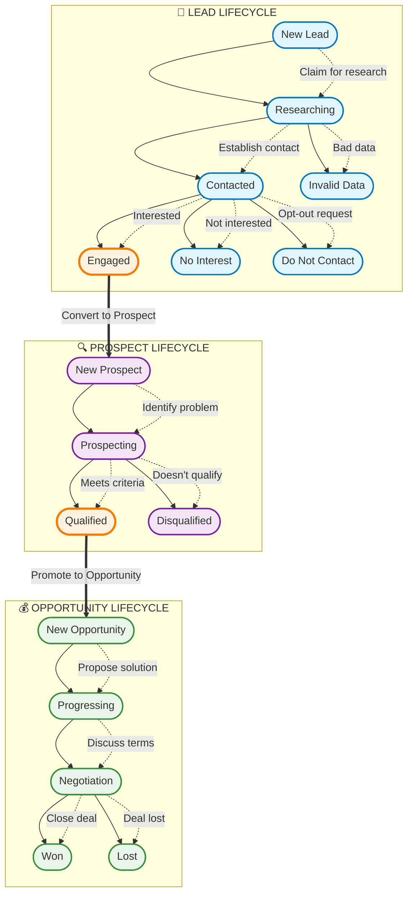

# Custom CRM Workflow - Main Overview

This diagram shows the complete Lead → Prospect → Opportunity progression for the custom HaloPSA CRM integration.

## Complete Workflow Overview

## Workflow Summary

### 🎯 Lead Lifecycle (7 States)
- **New Lead** → **Researching** → **Contacted** → **Engaged** ✅
- Exit paths: No Interest, Do Not Contact, Invalid Data

### 🔍 Prospect Lifecycle (4 States)  
- **New Prospect** → **Prospecting** → **Qualified** ✅
- Exit path: Disqualified

### 💰 Opportunity Lifecycle (5 States)
- **New Opportunity** → **Progressing** → **Negotiation** → **Won/Lost**

### 🚀 Automation Rules
- **Lead (Engaged)** → Auto-convert to **Prospect**
- **Prospect (Qualified + Fit Score ≥70)** → Auto-promote to **Opportunity**

---
*This workflow is implemented in the Custom CRM Workflow Integrator service*