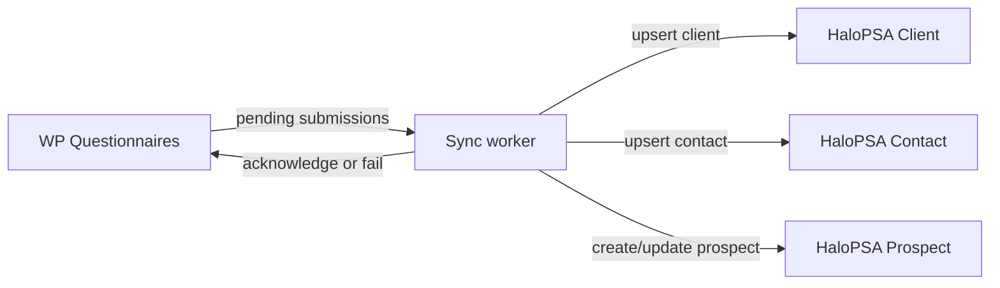

# WP Questionnaires → HaloPSA Prospect Sync

This package is a dedicated custom integration for collecting completed leads from the `wp-questionnaires` WordPress plugin and creating or updating CRM prospect records in HaloPSA.

## Purpose

The integration pulls completed questionnaire submissions from the Alltime WordPress site, then creates a HaloPSA CRM record that can be worked as a Prospect / Interested client.

Target source:

```text
https://alltimetech.co.uk/wp-json/wpq/v1/api/submissions/pending
```

Target HaloPSA areas:

- Client / organisation record.
- Contact record.
- Prospect or opportunity-style CRM record.
- Campaign/list association using the questionnaire name.
- Custom fields containing score, grade, answers, domain scores, recommendations, attribution, and source references.

## Integration model

The WordPress plugin already exposes a pull-oriented API for HaloPSA integration.



The worker uses this loop:

1. Poll pending WordPress submissions.
2. Mark each submission as processing.
3. Resolve or create the HaloPSA client.
4. Resolve or create the HaloPSA contact.
5. Resolve the campaign/list name from the questionnaire name.
6. Create or update the HaloPSA prospect record.
7. Acknowledge the WordPress submission with the HaloPSA record ID.
8. Report failures back to WordPress with retry intent.

## Required WordPress configuration

Create a dedicated WordPress user with the `WPQ HaloPSA API` role and generate an Application Password for it.

Required WPQ endpoints:

| Method | Endpoint | Purpose |
|---|---|---|
| `GET` | `/wp-json/wpq/v1/api/submissions/pending` | Retrieve pending submissions. |
| `POST` | `/wp-json/wpq/v1/api/submissions/{id}/start` | Mark a submission as processing. |
| `POST` | `/wp-json/wpq/v1/api/submissions/{id}/acknowledge` | Mark a submission as synced. |
| `POST` | `/wp-json/wpq/v1/api/submissions/{id}/fail` | Mark a submission as failed or retry pending. |

## Required HaloPSA configuration

Create an OAuth application or custom integration credential in HaloPSA, then configure the tenant URL, client ID, client secret, and scope in `.env`.

The exact HaloPSA field IDs, status IDs, ticket type IDs, list/campaign endpoint, and CRM object shape vary by tenant configuration. This package therefore uses environment variables and `config/field-map.example.json` as the mapping layer rather than hard-coding tenant-specific IDs.

## Important implementation note

The current WPQ detail formatter exposes lead details, answers, domain scores, scoring summary, attribution, and sync status. It does not yet expose the stored `findings_json` recommendations. This integration is prepared to map `findings`, `recommendations`, or `top_actions` if the WordPress API adds them. Until then, recommendations can only be captured if the source API is extended.

## Quick start

```bash
cd integrations/wp-questionnaires-halopsa
cp .env.example .env
node src/index.js --dry-run
node src/index.js
```

The package uses Node.js 20+ and the built-in `fetch` API. No runtime dependency is required for the first implementation.

## Files

```text
config/field-map.example.json    Example mapping for HaloPSA custom fields.
docs/data-map.md                 Source-to-target data mapping.
docs/halo-custom-integration-research.md  Integration assumptions and open verification items.
src/config.js                    Environment parsing.
src/http.js                      HTTP helpers.
src/wpq-client.js                WordPress WPQ API client.
src/halo-client.js               HaloPSA API client.
src/mapper.js                    WPQ to HaloPSA mapping logic.
src/sync.js                      Polling and sync orchestration.
src/index.js                     CLI entry point.
```
